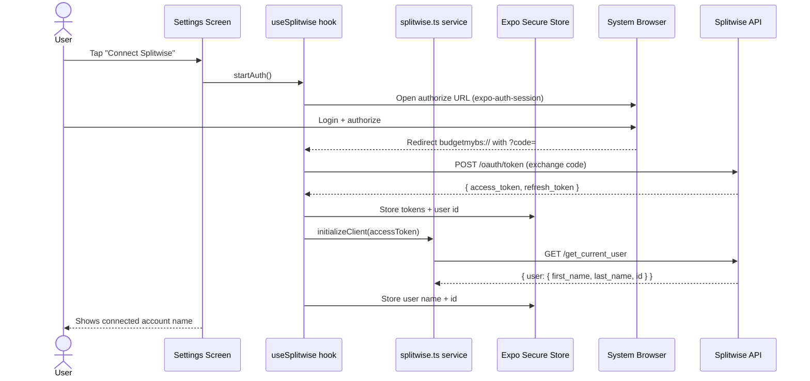
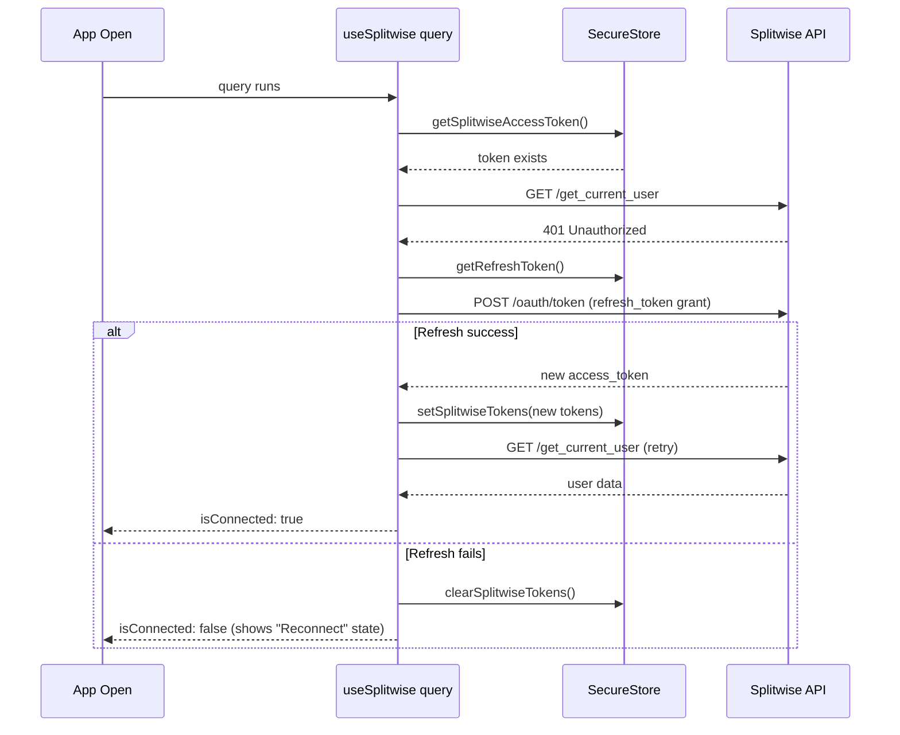

# Low Level Design: Splitwise Auth & Connection (Phase 1)

**Status**: Draft
**Date**: 2026-03-19
**PRD Reference**: Grill-me session (conversation) + `plans/splitwise-integration.md`
**Related Plan**: `plans/splitwise-integration.md` — Phase 1

---

## 1. Overview

Phase 1 wires up the Splitwise OAuth2 Authorization Code flow so users can connect their personal Splitwise account to budgetmybs. Once connected, the access token is stored securely and a `Client` instance is available for all subsequent Splitwise API calls in later phases. The user can also disconnect, which clears all stored credentials.

---

## 2. Goals & Non-Goals

**Goals**

- User can tap "Connect Splitwise" in Settings and complete the OAuth2 Authorization Code flow in the browser
- Access token and user identity are persisted in Expo Secure Store
- Settings screen shows connected account name and avatar after auth
- User can disconnect, clearing all stored tokens
- Silent re-authentication is attempted when an existing token is found but expired
- A singleton `Client` (from `splitwise-ts`) is available to the rest of the app via a service layer

**Non-Goals**

- No syncing of expenses (Phase 2)
- No split UI on transaction form (Phase 4)
- No onboarding step (Phase 7)
- Refresh token rotation / long-lived session management beyond basic silent re-auth

---

## 3. Background & Context

The app is currently **offline-first** with no external auth. The only existing credential-management pattern is `src/config/env.ts`, which stores/retrieves the Gemini API key via `expo-secure-store`.

`splitwise-ts` (already in `package.json` at `^1.1.2`) provides a typed `Client` class that accepts an auth object and attaches `Authorization: Bearer {token}` to every request. Its built-in `OAuth2User` uses **Client Credentials Grant** (machine-to-machine), which is not suitable for end-user auth. We bypass it entirely and supply the token ourselves via a thin adapter.

The app scheme is `budgetmybs` (confirmed in `app.json`), which serves as the deep-link base for the OAuth redirect URI.

`expo-auth-session` and `expo-web-browser` are **not yet installed** and must be added.

---

## 4. High-Level Design



---

## 5. Detailed Design

### 5.1 Component Breakdown

| Component                | File                                                  | Responsibility                                                             | Status   |
| ------------------------ | ----------------------------------------------------- | -------------------------------------------------------------------------- | -------- |
| Splitwise config         | `src/config/splitwise.ts`                             | Token get/set/clear in Secure Store, `isConnected()`                       | New      |
| Splitwise service        | `src/services/splitwise.ts`                           | Initialize `Client`, `getCurrentUser()`, token adapter                     | New      |
| Splitwise hook           | `src/hooks/useSplitwise.ts`                           | TanStack Query for connection state, `connect()`, `disconnect()` mutations | New      |
| Settings screen          | `app/dashboard/settings.tsx`                          | Add "Integrations" section with connect/disconnect card                    | Modified |
| Splitwise card component | `src/components/settings/SplitwiseConnectionCard.tsx` | Self-contained connect/disconnect UI                                       | New      |
| Hook index               | `src/hooks/index.ts`                                  | Export `useSplitwise`                                                      | Modified |

### 5.2 Data Model Changes

No database changes in Phase 1. All state is stored in Expo Secure Store.

**Secure Store keys** (defined as constants in `src/config/splitwise.ts`):

| Key                       | Value                      | Notes                                    |
| ------------------------- | -------------------------- | ---------------------------------------- |
| `SPLITWISE_ACCESS_TOKEN`  | OAuth access token string  | Required for API calls                   |
| `SPLITWISE_REFRESH_TOKEN` | OAuth refresh token string | For silent re-auth                       |
| `SPLITWISE_USER_ID`       | Splitwise user ID (string) | Stored after first `getCurrentUser` call |
| `SPLITWISE_USER_NAME`     | Full name from Splitwise   | Displayed in Settings                    |
| `SPLITWISE_USER_AVATAR`   | Avatar URL string          | Displayed in Settings                    |

### 5.3 New Dependencies

```bash
npx expo install expo-auth-session expo-web-browser
```

Both are official Expo packages that work with the managed workflow. No additional native configuration needed for the `budgetmybs://` scheme since it is already declared in `app.json`.

### 5.4 Business Logic

#### `src/config/splitwise.ts`

Mirrors the pattern of `src/config/env.ts`. Provides:

```typescript
// Constants
const SPLITWISE_ACCESS_TOKEN_KEY = 'SPLITWISE_ACCESS_TOKEN'
const SPLITWISE_REFRESH_TOKEN_KEY = 'SPLITWISE_REFRESH_TOKEN'
const SPLITWISE_USER_ID_KEY = 'SPLITWISE_USER_ID'
const SPLITWISE_USER_NAME_KEY = 'SPLITWISE_USER_NAME'
const SPLITWISE_USER_AVATAR_KEY = 'SPLITWISE_USER_AVATAR'

export const SPLITWISE_CLIENT_ID = process.env.EXPO_PUBLIC_SPLITWISE_CLIENT_ID
export const SPLITWISE_CLIENT_SECRET = process.env.EXPO_PUBLIC_SPLITWISE_CLIENT_SECRET

// Token accessors
getSplitwiseAccessToken(): Promise<string | null>
setSplitwiseTokens(accessToken: string, refreshToken: string): Promise<void>
clearSplitwiseTokens(): Promise<void>
isSplitwiseConnected(): Promise<boolean>

// User identity accessors
getSplitwiseUser(): Promise<{ id: string; name: string; avatar: string | null } | null>
setSplitwiseUser(id: string, name: string, avatar: string | null): Promise<void>
clearSplitwiseUser(): Promise<void>
```

#### `src/services/splitwise.ts`

Mirrors the pattern of `src/services/gemini.ts`. Key responsibility: bridge our stored token to the `splitwise-ts` `Client`.

The `Client` constructor from `splitwise-ts` accepts an `OAuth2User` instance. Since we're bypassing their auth flow, we create a minimal adapter object that satisfies the `Client`'s expectations (it only reads `authUser.accessToken`):

```typescript
// Token adapter — satisfies the interface Client expects
function createTokenAdapter(accessToken: string) {
  return { accessToken }
}

// Returns a ready-to-use Client, or null if not connected
export const initializeSplitwiseClient = async (): Promise<Client | null>

// Fetches current user — used to verify connection and store user identity
export const getSplitwiseCurrentUser = async (client: Client): Promise<SplitwiseUser>
```

> **Assumption**: `splitwise-ts` `Client` reads `authUser.accessToken` as a plain property getter and does not call `requestAccessToken()` internally. This should be verified against the library source at `../splitwise-ts` before implementation. If it does call `requestAccessToken()`, the adapter must implement a no-op version of that method.

#### `src/hooks/useSplitwise.ts`

TanStack React Query hook. Follows the same pattern as `useProfile.ts`.

```typescript
// Query: connection state + user info
const SPLITWISE_CONNECTION_QUERY_KEY = ['splitwise', 'connection']

// Returns:
{
  isConnected: boolean,
  user: { id: string; name: string; avatar: string | null } | null,
  isLoading: boolean,
  connect: () => void,           // triggers OAuth flow
  disconnect: () => void,        // clears tokens + invalidates query
  isConnecting: boolean,
  isDisconnecting: boolean,
}
```

**`connect()` mutation flow:**

1. Call `makeRedirectUri({ scheme: 'budgetmybs' })` from `expo-auth-session`
2. Build authorization URL: `https://secure.splitwise.com/oauth/authorize?client_id=...&redirect_uri=...&response_type=code`
3. Open browser via `WebBrowser.openAuthSessionAsync(authUrl, redirectUri)`
4. Parse `code` from the returned redirect URL
5. Exchange code for token: `POST https://secure.splitwise.com/oauth/token` with `grant_type=authorization_code`
6. Store tokens via `setSplitwiseTokens()`
7. Initialize client via `initializeSplitwiseClient()`
8. Call `getSplitwiseCurrentUser()` and store identity via `setSplitwiseUser()`
9. Invalidate `SPLITWISE_CONNECTION_QUERY_KEY` → Settings re-renders with connected state

**`disconnect()` mutation flow:**

1. Call `clearSplitwiseTokens()` and `clearSplitwiseUser()`
2. Invalidate `SPLITWISE_CONNECTION_QUERY_KEY`

**Silent re-auth on app open:**

- On query execution, if `isSplitwiseConnected()` returns true but the first API call returns 401, attempt token refresh using the stored refresh token before surfacing an error
- If refresh fails, clear tokens and set connection state to disconnected

#### `app/dashboard/settings.tsx`

Add a new "Integrations" section below the existing "Appearance" section:

```tsx
{
  /* Integrations Section */
}
<BView gap="sm">
  <BText variant="subheading">Integrations</BText>
  <BCard variant="elevated">
    <SplitwiseConnectionCard />
  </BCard>
</BView>;
```

#### `src/components/settings/SplitwiseConnectionCard.tsx`

Self-contained component consuming `useSplitwise()`. Two states:

**Disconnected state:**

- Splitwise logo + "Splitwise" label
- "Connect" button → calls `connect()`
- Loading spinner while `isConnecting`

**Connected state:**

- User avatar (or initials fallback) + connected account name
- Green "Connected" badge
- "Disconnect" link → calls `disconnect()` after confirmation alert

### 5.5 Sequence Diagram — Silent Re-auth



---

## 6. Error Handling & Edge Cases

| Scenario                                    | Handling                                                                                  | User-facing                                                       |
| ------------------------------------------- | ----------------------------------------------------------------------------------------- | ----------------------------------------------------------------- |
| User cancels browser OAuth                  | `WebBrowser` returns `{ type: 'cancel' }` — no-op, mutation resolves cleanly              | Nothing (toggle stays off)                                        |
| Code exchange fails (bad code / network)    | Mutation throws, `isConnecting` resets to false                                           | Alert: "Connection failed. Please try again."                     |
| Token expired, refresh succeeds             | Silent — new token stored, query continues                                                | None                                                              |
| Token expired, refresh fails                | Tokens cleared, connection state = disconnected                                           | Non-blocking banner: "Reconnect Splitwise" (Phase 8 hardens this) |
| `getCurrentUser` fails after token exchange | Tokens still stored; connection shown as "Connected" but name = "Splitwise User" fallback | Graceful degradation                                              |
| Disconnect while connecting                 | Button disabled during `isConnecting`                                                     | N/A                                                               |
| `expo-secure-store` write fails             | Log error, throw — surface as connection failure                                          | Alert: "Failed to save credentials."                              |

---

## 7. Security Considerations

- `clientId` and `clientSecret` stored as `EXPO_PUBLIC_SPLITWISE_CLIENT_ID` / `EXPO_PUBLIC_SPLITWISE_CLIENT_SECRET` env vars. Note: `EXPO_PUBLIC_` vars are bundled into the JS bundle — they are not secret at runtime. For a production app with many users, a backend proxy for the token exchange step is the right call. For a personal-use app this is acceptable.
- Access token and refresh token stored in `expo-secure-store` (iOS Keychain / Android Keystore) — not in AsyncStorage.
- No token is logged or included in error messages.
- Redirect URI is hardcoded to the app's own scheme (`budgetmybs://`) — cannot be hijacked by another app on the same device since iOS/Android enforce scheme ownership.

---

## 8. Performance & Scalability

- The `useSplitwise` query runs once on mount. It reads only from Secure Store (no network call) to determine initial connection state — fast.
- `getCurrentUser` is called once per `connect()` to populate user identity. Result cached in Secure Store — no repeated network calls.
- No polling or background refresh in this phase.

---

## 9. Testing Plan

| Test type   | What's covered                                                                                       | Notes                           |
| ----------- | ---------------------------------------------------------------------------------------------------- | ------------------------------- |
| Unit        | `src/config/splitwise.ts` — get/set/clear with mocked SecureStore                                    | Mock `expo-secure-store`        |
| Unit        | `src/services/splitwise.ts` — `initializeSplitwiseClient` returns null when no token                 | Mock SecureStore returning null |
| Unit        | `src/hooks/useSplitwise.ts` — `disconnect()` clears store + invalidates query                        | Mock service layer              |
| Integration | Full connect flow: mock `WebBrowser.openAuthSessionAsync` returning a code URL, assert tokens stored | Mock network token exchange     |
| Manual      | OAuth flow end-to-end on device with real Splitwise dev app credentials                              | Required before merge           |

---

## 10. Rollout & Deployment

- **Feature flag**: None — Settings section is only visible once `useSplitwise` is wired up. No user can accidentally trigger it before the code ships.
- **Migration**: None — no DB changes.
- **Env vars needed**: `EXPO_PUBLIC_SPLITWISE_CLIENT_ID`, `EXPO_PUBLIC_SPLITWISE_CLIENT_SECRET` — must be added to `.env` and Expo build config before testing.
- **Splitwise developer app**: Must be registered at https://secure.splitwise.com/apps/new with redirect URI `budgetmybs://` before any testing.
- **Rollback**: Remove the "Integrations" section from settings.tsx — no data to clean up.

---

## 11. Open Questions

| #   | Question                                                                                                    | Resolution                                                                                                |
| --- | ----------------------------------------------------------------------------------------------------------- | --------------------------------------------------------------------------------------------------------- |
| 1   | Does `splitwise-ts` `Client` call `requestAccessToken()` on the auth object, or only read `.accessToken`?   | Verify against `../splitwise-ts/packages/splitwise-ts/src/lib/core/client.ts` before implementing adapter |
| 2   | Does Splitwise's OAuth2 token endpoint support `refresh_token` grant for Authorization Code flow?           | Confirm in Splitwise developer docs / test empirically                                                    |
| 3   | Should `EXPO_PUBLIC_SPLITWISE_CLIENT_SECRET` be used, or do we need a backend proxy for the token exchange? | Acceptable for personal-use app; revisit if app goes multi-user                                           |

---

## 12. Alternatives Considered

| Decision                                        | Alternative                                          | Why rejected                                                                                      |
| ----------------------------------------------- | ---------------------------------------------------- | ------------------------------------------------------------------------------------------------- |
| `expo-auth-session` for OAuth dance             | Use `splitwise-ts` `OAuth2User` (Client Credentials) | CC grant is machine-to-machine — doesn't authenticate end users, only the developer's account     |
| Store tokens in Expo Secure Store               | AsyncStorage                                         | AsyncStorage is unencrypted — inappropriate for OAuth tokens                                      |
| Bypass `OAuth2User`, pass raw token to `Client` | Subclass `OAuth2User`                                | Subclassing is fragile against library updates; a thin adapter object is simpler                  |
| Single "Integrations" section in Settings       | New tab in bottom nav                                | Bottom nav already has 3 tabs; adding a 4th for a connection-only screen is too heavy for Phase 1 |

---

## 13. Dependencies & External Integrations

- **`expo-auth-session`** — OAuth2 Authorization Code flow (to be installed)
- **`expo-web-browser`** — Opens auth URL in system browser (to be installed)
- **`expo-secure-store`** — Already installed (`^15.0.8`)
- **`splitwise-ts`** — Already installed (`^1.1.2`)
- **Splitwise developer portal** — App registration required (external, one-time)

---

## 14. References

- Plan: `plans/splitwise-integration.md`
- Existing credential pattern: `src/config/env.ts`
- Existing service pattern: `src/services/gemini.ts`
- Existing hook pattern: `src/hooks/useProfile.ts`
- `splitwise-ts` source: `../splitwise-ts/packages/splitwise-ts/src/`
- Splitwise OAuth docs: https://dev.splitwise.com/#section/Authentication
