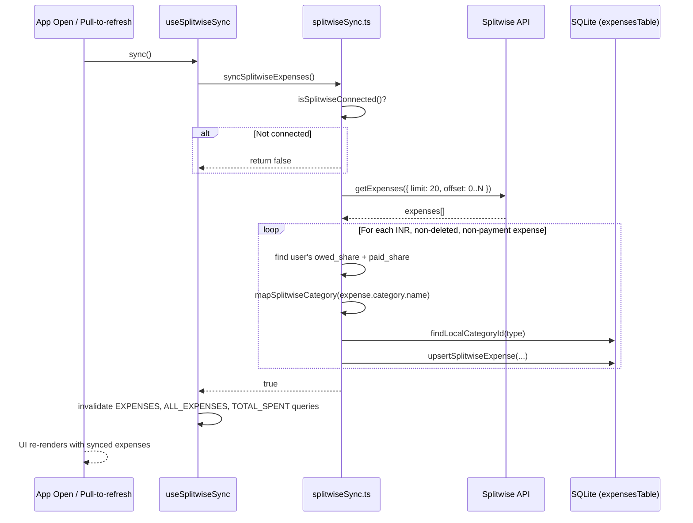
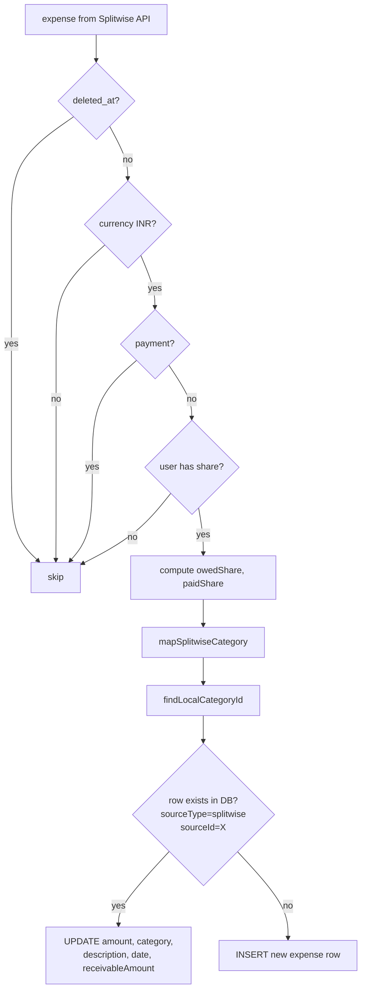

# Low Level Design: Splitwise Inbound Sync & Schema Extension (Phase 2)

**Status**: Draft
**Date**: 2026-03-19
**PRD Reference**: Grill-me session (conversation) + `plans/splitwise-integration.md`
**Related Plan**: `plans/splitwise-integration.md` — Phase 2
**Depends on**: Phase 1 (`docs/lld-splitwise-phase1-auth.md`)

---

## 1. Overview

Phase 2 extends the local SQLite schema to support Splitwise-sourced expenses and implements a one-way inbound sync that pulls INR expenses from the Splitwise API into the local database. When a friend adds the user to a Splitwise expense, it appears automatically in the budgetmybs transaction list after the next sync. Synced expenses carry a visual badge so the user can distinguish them from manually added ones.

---

## 2. Goals & Non-Goals

**Goals**

- Extend `expensesTable` with two new columns: `receivableAmount` and `receivableSettled`
- Add `splitwise` as a valid `RecurringSourceType` value
- Sync INR expenses from Splitwise into local SQLite on app open and on pull-to-refresh
- Upsert logic: re-syncing the same Splitwise expense updates the local record without creating duplicates
- Map Splitwise categories to budgetmybs `CategoryType`; unmapped → `other`
- Show a Splitwise badge on `TransactionCard` for synced expenses
- Record `receivableAmount` when the current user is the payer of a split expense

**Non-Goals**

- Settlement detection and budget reversal (Phase 5)
- Outbound push to Splitwise (Phase 4)
- Dashboard balances card (Phase 3)
- Background sync / push notifications
- Pagination beyond 200 most recent expenses (acceptable for Phase 2)

---

## 3. Background & Context

The app is fully offline-first: all data lives in local SQLite via Drizzle ORM. The existing `expensesTable` already has `sourceType` and `sourceId` columns used by the recurring engine (`fixed_expense`, `debt_emi`) to track auto-generated expenses. Phase 2 reuses this same pattern — Splitwise expenses are just another source type.

`processRecurringTransactions()` in `db/queries/recurring.ts` is the precedent for "external source → local expense" logic. Its dedup approach (check `sourceType + sourceId + sourceMonth`) informs the Splitwise upsert design.

Phase 1 delivered `initializeSplitwiseClient()` and `withSilentReauth()` in `src/services/splitwise.ts`, which Phase 2 builds on directly.

---

## 4. High-Level Design



---

## 5. Detailed Design

### 5.1 Component Breakdown

| Component               | File                                             | Responsibility                                                  | Status         |
| ----------------------- | ------------------------------------------------ | --------------------------------------------------------------- | -------------- |
| Expense schema          | `db/schema.ts`                                   | Add `receivableAmount`, `receivableSettled` columns             | Modified       |
| Source type enum        | `db/types.ts`                                    | Add `SPLITWISE = 'splitwise'` to `RecurringSourceTypeEnum`      | Modified       |
| Drizzle migration       | `drizzle/000X_*.sql`                             | ALTER TABLE for new columns                                     | Auto-generated |
| Upsert query            | `db/queries/expenses.ts`                         | `upsertSplitwiseExpense()` — insert-or-update by sourceId       | Modified       |
| Sync service            | `src/services/splitwiseSync.ts`                  | Category mapping, pagination, per-expense upsert orchestration  | New            |
| Sync hook               | `src/hooks/useSplitwiseSync.ts`                  | TanStack mutation; invalidates queries on success               | New            |
| TransactionCard         | `src/components/transaction/transactionCard.tsx` | Accept `isSplitwiseSynced` prop; render badge                   | Modified       |
| Dashboard screen        | `app/dashboard/index.tsx`                        | Trigger sync on mount via `useEffect`                           | Modified       |
| All-transactions screen | `app/all-transactions.tsx`                       | Pull-to-refresh triggers sync; pass `isSplitwiseSynced` to card | Modified       |
| Hook index              | `src/hooks/index.ts`                             | Export `useSplitwiseSync`                                       | Modified       |

### 5.2 Data Model Changes

**Table**: `expenses`
**Change type**: Add columns

```sql
ALTER TABLE expenses ADD COLUMN receivable_amount REAL;
ALTER TABLE expenses ADD COLUMN receivable_settled INTEGER NOT NULL DEFAULT 0;
```

| Column               | Type      | Nullable | Default | Purpose                                                                                                                                                 |
| -------------------- | --------- | -------- | ------- | ------------------------------------------------------------------------------------------------------------------------------------------------------- |
| `receivable_amount`  | `REAL`    | Yes      | `NULL`  | Set when `sourceType = 'splitwise'` and user paid more than their share. Represents the amount owed back by friends. `NULL` when user is not the payer. |
| `receivable_settled` | `INTEGER` | No       | `0`     | `0` = outstanding, `1` = friend has settled. Flipped in Phase 5 via sync.                                                                               |

**No new indexes needed**: upsert queries filter on `sourceType + sourceId` — both are short text columns with low cardinality. A full table scan on a device DB with <10k rows is acceptable. A composite index can be added in a future phase if performance profiling shows a need.

**Migration strategy**: Drizzle's `useMigrations()` in `db/provider.tsx` runs all pending migrations before the app renders. The two new columns are nullable / have defaults, so existing rows are unaffected with no backfill needed.

**`RecurringSourceTypeEnum` change** in `db/types.ts`:

```typescript
export const RecurringSourceTypeEnum = {
  FIXED_EXPENSE: 'fixed_expense',
  DEBT_EMI: 'debt_emi',
  SPLITWISE: 'splitwise', // ← new
} as const;
```

> **Note**: `getLastProcessedRecurringMonth()` in `db/queries/expenses.ts` uses `inArray(expensesTable.sourceType, [FIXED_EXPENSE, DEBT_EMI])` — it explicitly excludes `SPLITWISE`, so the recurring engine is unaffected.

### 5.3 API Design

No new REST endpoints — this is a mobile app with no backend. All "API" calls are direct Splitwise SDK calls via `splitwise-ts` `Client`.

**Splitwise endpoint used**: `client.expenses.getExpenses(params)`

Query params used:
| Param | Value | Reason |
|-------|-------|--------|
| `limit` | `20` | Splitwise API max per call |
| `offset` | `0, 20, 40…` | Pagination loop, capped at 200 |

Filters applied **in-app** (not supported as API params):

- `currency_code === 'INR'` — skip foreign currency
- `deleted_at == null` — skip deleted expenses
- `payment === false` — skip debt settlement transactions
- User must have a non-zero share — skip expenses where current user has no stake

**Response shape used** (relevant fields only):

```typescript
{
  id: number,
  description: string,
  date: string,          // ISO 8601, e.g. "2026-03-15T00:00:00Z"
  currency_code: string,
  cost: string,          // total cost as decimal string, e.g. "1000.0"
  payment: boolean,
  deleted_at: string | null,
  category: { id: number, name: string },
  users: Array<{
    user_id: number,
    owed_share: string,  // this user's share of the cost
    paid_share: string,  // amount this user actually paid
  }>
}
```

### 5.4 Business Logic

#### `db/types.ts` — RecurringSourceTypeEnum

Add `SPLITWISE: 'splitwise'`. No other changes to the enum file.

---

#### `db/queries/expenses.ts` — `upsertSplitwiseExpense()`

```typescript
type UpsertSplitwiseExpenseInput = {
  splitwiseId: string; // Splitwise expense ID → stored as sourceId
  amount: number; // User's owed share (what they actually owe)
  categoryId: string | null; // Resolved local category ID
  description: string | null;
  date: string; // YYYY-MM-DD
  receivableAmount: number | null; // paid_share - owed_share, if user is payer
};
```

Logic:

1. Compute `sourceMonth = getMonthFromDate(date)` (reuses existing utility)
2. Query for existing row: `WHERE sourceType = 'splitwise' AND sourceId = splitwiseId` — `LIMIT 1`
3. **If found**: `UPDATE` amount, categoryId, description, date, sourceMonth, receivableAmount
   - Does NOT touch `receivableSettled` — that is Phase 5's responsibility
4. **If not found**: `INSERT` with `sourceType = 'splitwise'`, `sourceId = splitwiseId`, `wasImpulse = 0`, `isSaving = 0`, `receivableSettled = 0`

---

#### `src/services/splitwiseSync.ts` — `syncSplitwiseExpenses()`

**Category mapping** — static lookup table:

| Splitwise category (substring match, case-insensitive) | budgetmybs `CategoryType` |
| ------------------------------------------------------ | ------------------------- |
| food, groceries                                        | `food`                    |
| entertainment, games, movies, music                    | `entertainment`           |
| sports, fitness                                        | `fitness`                 |
| transportation, travel, lodging                        | `travel`                  |
| health, medical                                        | `healthcare`              |
| shopping, clothing, electronics                        | `shopping`                |
| education                                              | `education`               |
| personal                                               | `personal_care`           |
| gifts, charity                                         | `gifts`                   |
| _(no match)_                                           | `other`                   |

`mapSplitwiseCategory(name: string): CategoryType` — iterates the map, returns first substring match.

`findLocalCategoryId(type: CategoryType): Promise<string | null>` — queries `categoriesTable WHERE type = ? AND isActive = 1 LIMIT 1`. Returns the local UUID for the category row. Returns `null` if somehow no active category of that type exists (edge case: user deleted all categories of a type).

**Sync flow** in `syncSplitwiseExpenses()`:

1. `isSplitwiseConnected()` → if false, return `false` immediately (no-op)
2. Call `withSilentReauth(runSync)` — handles token refresh transparently
3. `runSync(client)`:
   a. `getSplitwiseUser()` from SecureStore → get `currentUserId`
   b. Paginate: `offset = 0`, `hasMore = true`, `limit = 20`, safety cap at `offset >= 200`
   c. Each page: `client.expenses.getExpenses({ limit, offset })`
   d. Per expense:
   - Skip if `deleted_at` is set
   - Skip if `currency_code !== 'INR'`
   - Skip if `payment === true`
   - Find `userEntry = expense.users.find(u => u.user_id === currentUserId)`
   - Skip if no `userEntry` or both shares are `0`
   - `owedShare = parseFloat(userEntry.owed_share)`
   - `paidShare = parseFloat(userEntry.paid_share)`
   - `receivableAmount = paidShare - owedShare > 0.001 ? paidShare - owedShare : null`
   - `categoryType = mapSplitwiseCategory(expense.category?.name)`
   - `categoryId = await findLocalCategoryId(categoryType)`
   - `date = expense.date.split('T')[0]` (strip time component)
   - `await upsertSplitwiseExpense({ splitwiseId, amount: owedShare, categoryId, description, date, receivableAmount })`
     e. If page returns fewer than `limit` items → set `hasMore = false`
4. Return `true`

---

#### `src/hooks/useSplitwiseSync.ts`

TanStack `useMutation` hook. Mirrors the pattern of other hooks in `src/hooks/`.

```typescript
const syncMutation = useMutation({
  mutationFn: async () => {
    const connected = await isSplitwiseConnected();
    if (!connected) return false;
    return syncSplitwiseExpenses();
  },
  onSuccess: (synced) => {
    if (!synced) return;
    queryClient.invalidateQueries({ queryKey: EXPENSES_QUERY_KEY });
    queryClient.invalidateQueries({ queryKey: ALL_EXPENSES_QUERY_KEY });
    queryClient.invalidateQueries({ queryKey: TOTAL_SPENT_QUERY_KEY });
  },
});
```

Returns: `{ sync, syncAsync, isSyncing }`

---

#### `src/components/transaction/transactionCard.tsx` — badge

Add `isSplitwiseSynced?: boolean` to `TransactionCardProps`.

When `isSplitwiseSynced === true`, render a small pill badge below the amount:

- Icon: `people-outline` (Ionicons, `xs` size)
- Label: "Splitwise"
- Color: Splitwise brand green `#1BAE83`
- Background: `rgba(27, 174, 131, 0.12)`

The badge sits in a column alongside the amount on the right side of the card, so the card layout becomes:

```
[ icon badge ]  [ description     ]    [ -₹500      ]
               [ date · category  ]    [ ⚇ Splitwise ]  ← badge only when synced
```

---

#### `app/dashboard/index.tsx` — sync on mount

Add `useSplitwiseSync` to the existing hook list. Add a `useEffect` that calls `sync()` once on mount:

```typescript
const { sync: syncSplitwise } = useSplitwiseSync();
useEffect(() => {
  syncSplitwise();
}, []);
```

The sync is fire-and-forget: errors are silently swallowed (no user-facing error in Phase 2 — hardening is Phase 8). The `isSyncing` state is not exposed in the dashboard UI in this phase.

---

#### `app/all-transactions.tsx` — pull-to-refresh

The existing `SectionList` already has `onRefresh` / `refreshing` props. Replace them with a `RefreshControl` component that:

1. Calls `syncSplitwise()` first
2. On sync success, calls the existing `refetch()` for the local query

```typescript
const { sync: syncSplitwise, isSyncing } = useSplitwiseSync();

const handleRefresh = () => {
  syncSplitwise(undefined, { onSuccess: () => refetch() });
};
```

Pass `isSplitwiseSynced={item.sourceType === 'splitwise'}` to the `TransactionCard` in `renderItem`.

### 5.5 Sequence Diagram — Upsert Decision



---

## 6. Error Handling & Edge Cases

| Scenario                                              | Handling                                                                | User-facing                                        |
| ----------------------------------------------------- | ----------------------------------------------------------------------- | -------------------------------------------------- |
| Splitwise not connected                               | `isSplitwiseConnected()` returns false → sync is a no-op                | Nothing                                            |
| Token expired during sync                             | `withSilentReauth` retries once with refreshed token                    | Nothing (silent)                                   |
| Token refresh fails                                   | `withSilentReauth` returns `null`; sync aborts; tokens cleared          | Nothing in Phase 2 — Phase 8 adds reconnect banner |
| `getExpenses` network error                           | Exception propagates out of `runSync`; mutation `onError` catches it    | Nothing shown in Phase 2                           |
| Splitwise expense with no matching user entry         | `userEntry` is undefined → `continue` (skip)                            | Nothing                                            |
| `findLocalCategoryId` returns null                    | `categoryId = null` → expense inserted with no category                 | Expense shows without category label               |
| Duplicate sync call (double mount)                    | TanStack mutation deduplication: if `isPending`, second call is dropped | Nothing                                            |
| `receivableAmount` is negative or near-zero           | Guard: `paidShare - owedShare > 0.001` → else `null`                    | Nothing                                            |
| Date has time component (e.g. `2026-03-15T10:30:00Z`) | `split('T')[0]` strips time → stored as `YYYY-MM-DD`                    | Consistent date display                            |
| `expense.date` is null/undefined                      | Fallback: `new Date().toISOString().split('T')[0]` (today)              | Date shown as today — acceptable edge case         |

---

## 7. Security Considerations

- All Splitwise data is read-only in Phase 2 — no write back to Splitwise.
- `currentUserId` is read from Expo Secure Store (stored in Phase 1 after OAuth) — not from the Splitwise API response, to avoid trusting untrusted data for identity matching.
- Splitwise expense descriptions are stored as-is in SQLite. They are only displayed in the UI via `BText` which renders plain text — no XSS surface.
- No PII beyond what the user already has in their own Splitwise account is stored. Friend names are not stored at this phase.

---

## 8. Performance & Scalability

- **Sync frequency**: Once per app open + manual pull-to-refresh. Not continuous.
- **Pagination cap**: 200 expenses max per sync (10 pages × 20). Keeps sync time under ~2s on a typical connection.
- **`findLocalCategoryId` is called per expense**: This is N queries for N expenses. For 200 expenses with ~10 distinct category types, this results in up to 10 unique category lookups (SQLite will cache the others). Acceptable for a mobile device. If profiling shows slowness, an in-memory category map can be pre-loaded once per sync.
- **Upsert is 2 queries per expense**: A SELECT + UPDATE or SELECT + INSERT. No transactions needed since each expense is independent. For 200 expenses: 400 SQLite ops — fast on device storage.
- **React Query invalidation**: Invalidating 3 query keys triggers at most 3 re-fetches. All are SQLite reads — no network traffic.

---

## 9. Testing Plan

| Test type | What's covered                                                                                          | Notes                                          |
| --------- | ------------------------------------------------------------------------------------------------------- | ---------------------------------------------- |
| Unit      | `mapSplitwiseCategory()` — all known Splitwise category names → correct type                            | Pure function, easy to test                    |
| Unit      | `upsertSplitwiseExpense()` — insert path: verify row created with correct fields                        | Mock `db`                                      |
| Unit      | `upsertSplitwiseExpense()` — update path: verify amount/category updated, `receivableSettled` untouched | Mock `db`                                      |
| Unit      | `syncSplitwiseExpenses()` — skips deleted expenses                                                      | Mock client                                    |
| Unit      | `syncSplitwiseExpenses()` — skips non-INR expenses                                                      | Mock client                                    |
| Unit      | `syncSplitwiseExpenses()` — skips payment entries                                                       | Mock client                                    |
| Unit      | `syncSplitwiseExpenses()` — correctly computes `receivableAmount` when `paidShare > owedShare`          | Mock client                                    |
| Unit      | `syncSplitwiseExpenses()` — returns false when not connected                                            | Mock `isSplitwiseConnected`                    |
| Manual    | Pull-to-refresh on all-transactions shows synced Splitwise expenses with badge                          | On device with real Splitwise account          |
| Manual    | Re-sync does not create duplicate expense rows                                                          | Add expense in Splitwise, sync twice, check DB |

---

## 10. Rollout & Deployment

- **Feature flag**: None — sync is gated on `isSplitwiseConnected()`. Users without Splitwise connected see no change.
- **Migration**: `drizzle/000X_*.sql` runs automatically on app load via `DatabaseProvider`. No manual steps.
- **Rollback**: Drop `receivable_amount` and `receivable_settled` columns. The `SPLITWISE` enum value is only referenced in sync code — removing the sync service restores prior behavior. Existing Splitwise-sourced rows can be cleaned up with `DELETE FROM expenses WHERE source_type = 'splitwise'`.
- **Monitoring**: No server-side monitoring. Sync errors are logged to console in development.

---

## 11. Open Questions

| #   | Question                                                                                                                                                        | Resolution                                                                                                                           |
| --- | --------------------------------------------------------------------------------------------------------------------------------------------------------------- | ------------------------------------------------------------------------------------------------------------------------------------ |
| 1   | Splitwise API `get_expenses` — does it return the authenticated user's own `user_id` in the `users` array consistently, or only for group expenses?             | Verify manually with a real API response before finalising `userEntry` lookup                                                        |
| 2   | Should sync run on every dashboard mount (potentially on every tab switch), or only on cold app open?                                                           | Currently: every mount. Consider `AppState` change detection (foreground → background → foreground) to limit to true app-open events |
| 3   | What is the actual Splitwise API rate limit for `get_expenses`? The self-serve API has "conservative limits". If a user has >200 expenses, they won't all sync. | Accept 200 cap for Phase 2; revisit with `updated_after` incremental sync in a future phase                                          |

---

## 12. Alternatives Considered

| Decision                                | Alternative                                                                        | Why rejected                                                                                                                                                     |
| --------------------------------------- | ---------------------------------------------------------------------------------- | ---------------------------------------------------------------------------------------------------------------------------------------------------------------- |
| Upsert by SELECT + INSERT/UPDATE        | Use SQLite `INSERT OR REPLACE`                                                     | `INSERT OR REPLACE` deletes and re-inserts, losing the existing row's `id` (primary key). Breaks any foreign key references and React Query cache keyed by `id`. |
| Upsert by SELECT + INSERT/UPDATE        | Add a unique constraint on `(sourceType, sourceId)` + Drizzle `onConflictDoUpdate` | Cleaner, but requires a new migration for the unique index on top of the column migration. Deferred to a future cleanup.                                         |
| Sync category by name lookup at runtime | Pre-build a static in-memory map                                                   | Static map chosen: no async DB lookup per expense for categories, simpler, deterministic                                                                         |
| Filter INR server-side                  | Splitwise API has no `currency_code` filter param                                  | Must filter client-side                                                                                                                                          |
| `useEffect` in dashboard for sync       | `AppState` listener for foreground transitions                                     | `useEffect` on mount is simpler and sufficient for Phase 2. `AppState` approach avoids re-syncing on tab switches — can be added in Phase 8 hardening.           |

---

## 13. Dependencies & External Integrations

- **Phase 1** (`src/services/splitwise.ts`): `initializeSplitwiseClient()`, `withSilentReauth()`, `getSplitwiseUser()`
- **Phase 1** (`src/config/splitwise.ts`): `isSplitwiseConnected()`
- **`splitwise-ts`**: `client.expenses.getExpenses()` — already installed
- **Drizzle ORM**: `db.select`, `db.insert`, `db.update` on `expensesTable`
- **TanStack React Query**: `useMutation`, `queryClient.invalidateQueries`

---

## 14. References

- Plan: `plans/splitwise-integration.md` — Phase 2
- Phase 1 LLD: `docs/lld-splitwise-phase1-auth.md`
- Recurring engine (design precedent): `db/queries/recurring.ts`
- Expense upsert target: `db/queries/expenses.ts`
- TransactionCard: `src/components/transaction/transactionCard.tsx`
- All transactions screen: `app/all-transactions.tsx`
- Dashboard screen: `app/dashboard/index.tsx`
- Splitwise OpenAPI spec: `assets/json/openapi.json`
