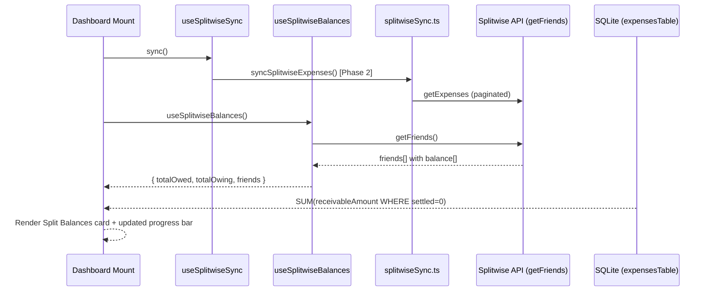
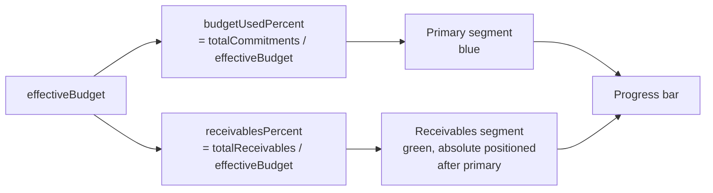

# Low Level Design: Splitwise Dashboard Balances (Phase 3)

**Status**: Draft
**Date**: 2026-03-19
**PRD Reference**: Grill-me session + `plans/splitwise-integration.md`
**Related Plan**: `plans/splitwise-integration.md` — Phase 3
**Depends on**: Phase 1 (`docs/lld-splitwise-phase1-auth.md`), Phase 2 (`docs/lld-splitwise-phase2-inbound-sync.md`)

---

## 1. Overview

Phase 3 surfaces Splitwise balance data on the dashboard so users can see at a glance how much they are owed and how much they owe across all friends — without opening Splitwise. A "Split Balances" card appears below the budget hero card when Splitwise is connected. Tapping it opens a new full-screen friends balance list. The budget progress bar gains a second coloured segment representing the outstanding receivable amount (money the user paid on behalf of others and hasn't been reimbursed for yet).

---

## 2. Goals & Non-Goals

**Goals**

- Fetch friend balances from `client.friends.getFriends()` during sync and expose "you are owed" / "you owe" totals
- Show a "Split Balances" card on the dashboard (hidden when Splitwise is not connected)
- New screen `app/splitwise-balances.tsx` listing all friends with non-zero INR balances
- Budget progress bar shows a distinct green segment for total unsettled `receivableAmount` from local DB
- Balances update automatically after each sync (query invalidation)

**Non-Goals**

- Settlement detection or `receivableSettled` flipping (Phase 5)
- Outbound expense creation (Phase 4)
- Push notifications for new balances
- Multi-currency balance display (INR only)
- Friend profile editing or adding new friends

---

## 3. Background & Context

The dashboard hero card already shows `budgetRemaining` and a single-colour progress bar (`themeColors.primary`). The budget remaining is computed in `app/dashboard/index.tsx` as `effectiveBudget - totalCommitments`.

Phase 2 introduced `receivableAmount` on `expensesTable` — when the user paid for a group expense, the portion owed back by friends is stored there (`receivableSettled = 0`). This local data is the source for the green "you are owed" progress bar segment.

The Splitwise friends API (`client.friends.getFriends()`) returns per-friend balances including a `balance` array with `{ currency_code, amount }` entries. A positive amount means the friend owes the current user; a negative amount means the current user owes the friend. Summing across all friends gives the two headline numbers.

Friend balances from the API and receivables from the local DB are complementary:

- **Local DB `receivableAmount`**: used for the progress bar (already in-flight budget impact)
- **Splitwise friends API**: used for the dashboard card and friends list screen (true net Splitwise balance)

---

## 4. High-Level Design



---

## 5. Detailed Design

### 5.1 Component Breakdown

| Component           | File                                             | Responsibility                                                                           | Status   |
| ------------------- | ------------------------------------------------ | ---------------------------------------------------------------------------------------- | -------- |
| Balances service    | `src/services/splitwiseBalances.ts`              | `fetchFriendBalances()` — call `getFriends`, filter INR, compute totals                  | New      |
| Balances hook       | `src/hooks/useSplitwiseBalances.ts`              | TanStack Query; returns `totalOwed`, `totalOwing`, `friends`                             | New      |
| Receivables query   | `db/queries/expenses.ts`                         | `getTotalUnsettledReceivables()` — SUM of `receivableAmount WHERE receivableSettled=0`   | Modified |
| Receivables hook    | `src/hooks/useSplitwiseReceivables.ts`           | TanStack Query wrapping `getTotalUnsettledReceivables()`                                 | New      |
| Split Balances card | `src/components/dashboard/SplitBalancesCard.tsx` | Two-row card: "You are owed" (green) + "You owe" (red); tap navigates to balances screen | New      |
| Dashboard screen    | `app/dashboard/index.tsx`                        | Insert `<SplitBalancesCard>` below budget card; update progress bar logic                | Modified |
| Balances screen     | `app/splitwise-balances.tsx`                     | Full-screen FlatList of friends with non-zero INR balances                               | New      |
| Hook index          | `src/hooks/index.ts`                             | Export `useSplitwiseBalances`, `useSplitwiseReceivables`                                 | Modified |
| Root layout         | `app/_layout.tsx`                                | Register `splitwise-balances` Stack.Screen                                               | Modified |

---

### 5.2 Data Model Changes

No new tables or columns. One new read-only query added to `db/queries/expenses.ts`:

```typescript
/**
 * Sum of all unsettled receivable amounts for the current month.
 * Used by the budget progress bar.
 */
export const getTotalUnsettledReceivables = async (month?: string): Promise<number> => {
  const targetMonth = month ?? getCurrentMonth();
  const result = await db
    .select({ total: sql<number>`COALESCE(SUM(${expensesTable.receivableAmount}), 0)` })
    .from(expensesTable)
    .where(
      and(
        like(expensesTable.date, `${targetMonth}%`),
        eq(expensesTable.sourceType, RecurringSourceTypeEnum.SPLITWISE),
        eq(expensesTable.receivableSettled, 0),
        isNotNull(expensesTable.receivableAmount)
      )
    );
  return result[0]?.total ?? 0;
};
```

---

### 5.3 API Design

No new REST endpoints. Two Splitwise SDK calls:

**`client.friends.getFriends()`** (already available via `splitwise-ts`)

Relevant response fields:

```typescript
{
  friends?: Array<{
    id?: number;
    first_name?: string;
    last_name?: string | null;
    picture?: { medium?: string };
    balance?: Array<{
      currency_code?: string;   // e.g. "INR"
      amount?: string;          // e.g. "500.00" (positive = they owe you, negative = you owe them)
    }>;
  }>
}
```

---

### 5.4 Business Logic

#### `src/services/splitwiseBalances.ts` — `fetchFriendBalances()`

```typescript
export type FriendBalance = {
  id: string;
  name: string;
  avatar: string | null;
  inrBalance: number; // positive = they owe user; negative = user owes them
};

export type SplitwiseBalanceSummary = {
  totalOwed: number; // sum of positive INR balances (friends owe user)
  totalOwing: number; // sum of absolute negative INR balances (user owes friends)
  friends: FriendBalance[];
};
```

Logic:

1. Call `withSilentReauth(async (client) => client.friends.getFriends())`
2. If null (not connected / refresh failed), return `{ totalOwed: 0, totalOwing: 0, friends: [] }`
3. For each friend in `response.friends ?? []`:
   - Find `inrEntry = friend.balance?.find(b => b.currency_code === 'INR')`
   - `inrBalance = inrEntry ? parseFloat(inrEntry.amount ?? '0') : 0`
   - Skip if `inrBalance === 0`
   - Build `FriendBalance` object
4. `totalOwed = friends.filter(f => f.inrBalance > 0).reduce((sum, f) => sum + f.inrBalance, 0)`
5. `totalOwing = friends.filter(f => f.inrBalance < 0).reduce((sum, f) => sum + Math.abs(f.inrBalance), 0)`
6. Return summary

---

#### `src/hooks/useSplitwiseBalances.ts`

```typescript
export const SPLITWISE_BALANCES_QUERY_KEY = ['splitwise', 'balances'] as const;

export const useSplitwiseBalances = () => {
  const query = useQuery({
    queryKey: SPLITWISE_BALANCES_QUERY_KEY,
    queryFn: fetchFriendBalances,
    staleTime: 2 * 60 * 1000, // 2 minutes — balances don't change faster than sync
    enabled: true, // fetchFriendBalances handles disconnected state gracefully
  });

  return {
    totalOwed: query.data?.totalOwed ?? 0,
    totalOwing: query.data?.totalOwing ?? 0,
    friends: query.data?.friends ?? [],
    isLoading: query.isLoading,
    refetch: query.refetch,
  };
};
```

`useSplitwiseSync` must also invalidate `SPLITWISE_BALANCES_QUERY_KEY` in its `onSuccess` — update `src/hooks/useSplitwiseSync.ts`:

```typescript
queryClient.invalidateQueries({ queryKey: SPLITWISE_BALANCES_QUERY_KEY });
```

---

#### `src/hooks/useSplitwiseReceivables.ts`

```typescript
export const SPLITWISE_RECEIVABLES_QUERY_KEY = ['splitwise', 'receivables'] as const;

export const useSplitwiseReceivables = (month?: string) => {
  const query = useQuery({
    queryKey: [...SPLITWISE_RECEIVABLES_QUERY_KEY, { month }],
    queryFn: () => getTotalUnsettledReceivables(month),
  });
  return { totalReceivables: query.data ?? 0 };
};
```

`useSplitwiseSync` must also invalidate `SPLITWISE_RECEIVABLES_QUERY_KEY` in its `onSuccess`.

---

#### `src/components/dashboard/SplitBalancesCard.tsx`

Props:

```typescript
type SplitBalancesCardProps = {
  totalOwed: number;
  totalOwing: number;
  isLoading: boolean;
};
```

Renders a `BCard` with:

- Header row: `people-outline` icon + "Split Balances" label
- Two data rows:
  - "You are owed" — `formatCurrency(totalOwed)` in `themeColors.success`
  - "You owe" — `formatCurrency(totalOwing)` in `themeColors.error`
- Chevron right icon to indicate navigation
- The entire card is wrapped in `<BLink href="/splitwise-balances">` for navigation

Hidden entirely when both `totalOwed === 0 && totalOwing === 0 && !isLoading`. This naturally hides the card when Splitwise is not connected (since `fetchFriendBalances` returns zeros when disconnected).

---

#### `app/dashboard/index.tsx` — changes

1. Add `useSplitwiseBalances` and `useSplitwiseReceivables` hooks
2. Insert `<SplitBalancesCard>` between the budget card and the stat cards:

```tsx
{
  /* Budget Card */
}
<BView paddingX={SpacingValue.LG} style={styles.budgetCardWrapper}>
  ...budget card JSX...
</BView>;

{
  /* Split Balances Card — only when connected */
}
<SplitBalancesCard totalOwed={totalOwed} totalOwing={totalOwing} isLoading={isBalancesLoading} />;

{
  /* Spent/Saved Cards */
}
```

3. **Progress bar update** — split the single fill into two segments:

```
|←— commitments (primary) —→|←— receivables (success) —→|          |
```

`receivablesPercent = effectiveBudget > 0 ? (totalReceivables / effectiveBudget) * 100 : 0`

The existing `budgetUsedPercent` remains based on `totalCommitments` only (receivables are separate — they represent money the user already paid out but expects back, not pure spending). The progress bar renders:

```tsx
<View style={[styles.progressBarBg, { backgroundColor: themeColors.muted }]}>
  {/* Regular spending segment */}
  <View
    style={[
      styles.progressBarFill,
      { width: `${Math.min(budgetUsedPercent, 100)}%`, backgroundColor: themeColors.primary },
    ]}
  />
  {/* Receivables segment — green, starts after spending segment */}
  {totalReceivables > 0 && (
    <View
      style={[
        styles.progressBarFill,
        styles.progressBarReceivables,
        {
          width: `${Math.min(receivablesPercent, 100 - budgetUsedPercent)}%`,
          backgroundColor: themeColors.success,
        },
      ]}
    />
  )}
</View>
```

`progressBarReceivables` style: `{ position: 'absolute', left: `${budgetUsedPercent}%` }` — positioned after the spending segment.

Caption updated: `"{budgetUsedPercent}% used · {receivablesPercent}% in transit"` when `totalReceivables > 0`.

---

#### `app/splitwise-balances.tsx` — new screen

Full-screen list of friends with non-zero INR balances.

```
┌──────────────────────────────────────┐
│ ← Split Balances                     │
├──────────────────────────────────────┤
│  Summary row:                        │
│  You are owed ₹X · You owe ₹Y        │
├──────────────────────────────────────┤
│  [Avatar] Rahul              +₹500   │ ← green (they owe user)
│  [Avatar] Priya              -₹200   │ ← red (user owes them)
│  [Avatar] Aditya             +₹150   │
└──────────────────────────────────────┘
```

- Uses `useSplitwiseBalances()` for data
- `FlatList` with `ListHeaderComponent` showing the summary totals
- Each row: friend avatar (or initials fallback), name, INR balance coloured green/red
- Empty state: "All settled up!" with a checkmark icon
- Loading state: skeleton or spinner
- Back navigation via Expo Router `<Stack.Screen options={{ title: 'Split Balances' }} />`

---

### 5.5 Sequence Diagram — Progress Bar Segments



---

## 6. Error Handling & Edge Cases

| Scenario                                       | Handling                                                                        | User-facing                                       |
| ---------------------------------------------- | ------------------------------------------------------------------------------- | ------------------------------------------------- |
| Splitwise not connected                        | `fetchFriendBalances` returns zeros; `SplitBalancesCard` stays hidden           | Nothing                                           |
| `getFriends` network error                     | `withSilentReauth` catches; returns `{ totalOwed:0, totalOwing:0, friends:[] }` | Card stays hidden                                 |
| Token refresh fails                            | Same as above — zeros returned                                                  | Nothing in Phase 3; Phase 8 adds reconnect banner |
| All friends settled                            | `friends` array empty after zero-filter                                         | "All settled up!" empty state on balances screen  |
| Friend has only non-INR balances               | Filtered out — `inrEntry` is `undefined` → `inrBalance = 0` → skipped           | Friend not shown                                  |
| `receivableAmount` column is NULL              | `COALESCE(SUM(...), 0)` returns 0 safely                                        | Progress bar shows no green segment               |
| Budget is 0 (no salary set)                    | `effectiveBudget = 0` → `receivablesPercent = 0`                                | No division; both segments hidden                 |
| `budgetUsedPercent + receivablesPercent > 100` | Both clamped: `Math.min(receivablesPercent, 100 - budgetUsedPercent)`           | Bar fills to 100% without overflow                |
| Balances screen opened before sync completes   | `isLoading = true` → spinner shown                                              | Spinner, no flash of empty state                  |

---

## 7. Security Considerations

- Friend names and avatars from Splitwise API are displayed via `BText` / `Image` — no XSS surface in React Native.
- Friend IDs and balances are only held in memory (TanStack Query cache) — not persisted to SQLite. No PII written to device storage beyond what Phase 1 already stores (user's own name/avatar).
- `withSilentReauth` wraps the `getFriends` call — token never exposed to the balances screen component.

---

## 8. Performance & Scalability

- **`getFriends` call frequency**: Once per dashboard mount (same cadence as expense sync). Result cached in TanStack Query for 2 minutes (`staleTime`).
- **Friend count**: Splitwise free tier supports hundreds of friends. `getFriends` returns all in one call (no pagination). For typical users (<100 friends), response is <5KB — negligible.
- **`getTotalUnsettledReceivables`**: Single `SUM` aggregate query on `expensesTable` filtered by month and sourceType. Runs in <5ms on device SQLite.
- **Progress bar re-render**: Only recomputes when `totalReceivables` or `totalCommitments` change — both are memoised by TanStack Query.

---

## 9. Testing Plan

| Test type | What's covered                                                                | Notes                                      |
| --------- | ----------------------------------------------------------------------------- | ------------------------------------------ |
| Unit      | `fetchFriendBalances()` — correctly sums positive/negative INR balances       | Mock `getFriends` response                 |
| Unit      | `fetchFriendBalances()` — skips non-INR balances                              | Mock friend with only USD balance          |
| Unit      | `fetchFriendBalances()` — returns zeros when not connected                    | Mock `withSilentReauth` → null             |
| Unit      | `getTotalUnsettledReceivables()` — sums only unsettled rows for current month | Mock DB                                    |
| Manual    | SplitBalancesCard hidden when not connected                                   | Disconnect → check dashboard               |
| Manual    | SplitBalancesCard shows correct totals after sync                             | Add expense in Splitwise, sync, check card |
| Manual    | Tapping card navigates to splitwise-balances screen                           | Verify navigation                          |
| Manual    | Progress bar shows green segment for receivable amounts                       | Pay for group expense, sync, check bar     |
| Manual    | Friends list shows correct per-friend balances                                | Compare with Splitwise app                 |

---

## 10. Rollout & Deployment

- **Feature flag**: None — gated on `isSplitwiseConnected()` via query returning zeros when disconnected.
- **Migration**: None — no schema changes.
- **Rollback**: Remove `SplitBalancesCard` from dashboard and revert progress bar to single segment. `splitwise-balances.tsx` screen can be removed without affecting other routes.
- **Monitoring**: No server-side monitoring. Balance fetch errors logged to console in development.

---

## 11. Open Questions

| #   | Question                                                                                                           | Resolution                                                                             |
| --- | ------------------------------------------------------------------------------------------------------------------ | -------------------------------------------------------------------------------------- |
| 1   | Should `SPLITWISE_BALANCES_QUERY_KEY` be invalidated independently (on dashboard focus) or only after a full sync? | Currently: only after sync. Consider `useEffect` with `AppState` in Phase 8 hardening. |
| 2   | If `budgetUsedPercent + receivablesPercent > 100`, should the progress bar overflow or clamp?                      | Clamp — bar never exceeds 100%. Both segments shrink proportionally if needed.         |
| 3   | Should the balances screen be a tab or a push screen?                                                              | Push screen (`Stack.Screen`) — reached by tapping the dashboard card only.             |

---

## 12. Alternatives Considered

| Decision                                       | Alternative                                 | Why rejected                                                                                                                                            |
| ---------------------------------------------- | ------------------------------------------- | ------------------------------------------------------------------------------------------------------------------------------------------------------- |
| Friends balances from API                      | Derive "you owe" from local DB expense rows | Local DB only contains inbound synced expenses — expenses added by others where user isn't the payer may be missing. API gives the true net balance.    |
| Separate "receivables" segment in progress bar | Add receivables to `totalCommitments`       | Receivables are expected to return — inflating committed spend is misleading. Separate segment is visually distinct and informative.                    |
| Bottom sheet for friends list                  | New push screen                             | Bottom sheet limits screen real estate for users with many friends. Full screen is more scalable.                                                       |
| Persist friend balances to SQLite              | Keep in TanStack Query memory cache only    | Balances are volatile (change whenever any group member settles). Persisting creates stale data risk. Memory cache with 2-min stale time is sufficient. |

---

## 13. Dependencies & External Integrations

- **Phase 1**: `withSilentReauth()`, `isSplitwiseConnected()` from `src/services/splitwise.ts` / `src/config/splitwise.ts`
- **Phase 2**: `useSplitwiseSync` — must be updated to also invalidate `SPLITWISE_BALANCES_QUERY_KEY` and `SPLITWISE_RECEIVABLES_QUERY_KEY`
- **`splitwise-ts`**: `client.friends.getFriends()` — already installed
- **Expo Router**: New `app/splitwise-balances.tsx` route registered in `app/_layout.tsx`
- **TanStack React Query**: `useQuery` for balances + receivables; `queryClient.invalidateQueries` in sync hook

---

## 14. References

- Plan: `plans/splitwise-integration.md` — Phase 3
- Phase 1 LLD: `docs/lld-splitwise-phase1-auth.md`
- Phase 2 LLD: `docs/lld-splitwise-phase2-inbound-sync.md`
- Dashboard screen: `app/dashboard/index.tsx`
- Sync hook (to be updated): `src/hooks/useSplitwiseSync.ts`
- Splitwise `getFriends` type: `node_modules/splitwise-ts/dist/index.d.ts:317`
- `formatCurrency` utility: `src/utils/format.ts`
- Theme colours: `src/constants/theme/colors.ts`
