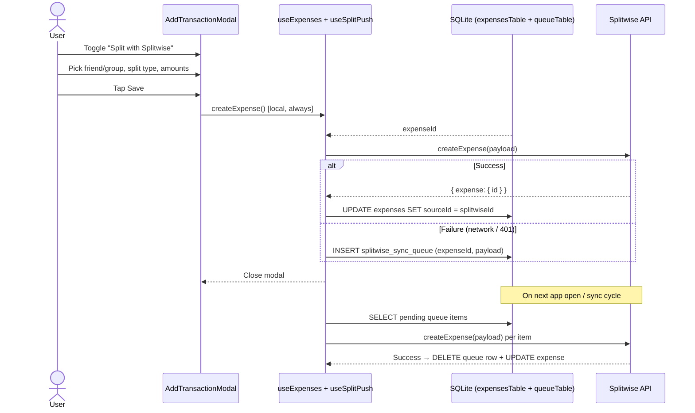
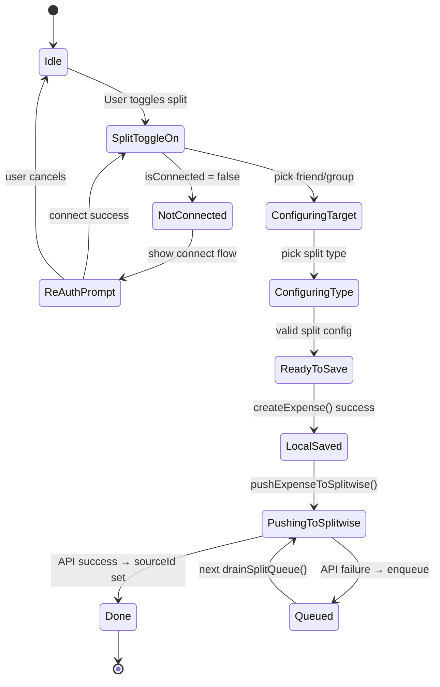

# Low Level Design: Splitwise Outbound Split (Phase 4)

**Status**: Draft
**Date**: 2026-03-19
**PRD Reference**: Grill-me session + `plans/splitwise-integration.md`
**Related Plan**: `plans/splitwise-integration.md` — Phase 4
**Depends on**: Phase 1 (`docs/lld-splitwise-phase1-auth.md`), Phase 2 (`docs/lld-splitwise-phase2-inbound-sync.md`), Phase 3 (`docs/lld-splitwise-phase3-dashboard-balances.md`)

---

## 1. Overview

Phase 4 lets users push a new expense from budgetmybs directly into Splitwise — splitting it with friends or a group without leaving the app. A "Split with Splitwise" toggle appears on the Add Transaction form (Expense tab only). When toggled on, the user picks a friend or group and chooses a split type. On save, the expense is created locally first; then a Splitwise `createExpense` API call is made. If the push fails (network error, expired token), the operation is stored in a new `splitwiseSyncQueueTable` and retried automatically on the next app open or sync cycle.

---

## 2. Goals & Non-Goals

**Goals**

- "Split with Splitwise" toggle on the Add Transaction modal (Expense tab only)
- Friend and group picker populated from Splitwise account
- Split type selector: Equal, Exact, Percentage, Shares, Adjustment
- Local expense always created first — Splitwise push is best-effort
- Failed pushes queued in `splitwiseSyncQueueTable`, retried on next sync
- Successfully pushed expenses show the Splitwise badge in the transaction list
- Disconnected state: toggling on prompts re-auth; cancel → toggle reverts

**Non-Goals**

- Editing or deleting an existing Splitwise-linked expense from budgetmybs (Phase 6)
- Settlement detection (Phase 5)
- Splitting savings entries (toggle only on Expense tab)
- Multi-currency splits (INR only)
- Creating new Splitwise groups from within the app
- Queue retry UI / manual retry (Phase 8)

---

## 3. Background & Context

The `AddTransactionModal` (`src/components/transaction/addTransactionModal.tsx`) currently has two tabs: Expense and Saving. Submitting an Expense calls `createExpense` from `useExpenses`, which inserts a row into `expensesTable`. There is no Splitwise interaction today.

The Splitwise `createExpense` API (`client.expenses.createExpense`) accepts either:

- **`split_equally: true`** — Splitwise auto-splits the cost equally among all users in a group, or between the current user and one friend.
- **Flat per-user fields** — `users__N__user_id`, `users__N__paid_share`, `users__N__owed_share` — for all other split types. The current user is always `users__0`.

The architectural decisions from `plans/splitwise-integration.md` call for a `splitwiseSyncQueueTable` to handle failed outbound operations. Phase 4 introduces this table.

`BSwitch` exists at `src/components/ui/switch.tsx` and is already theme-aware. `BDropdown` (searchable) is used in the existing transaction form. Both can be reused directly.

---

## 4. High-Level Design



---

## 5. Detailed Design

### 5.1 Component Breakdown

| Component                   | File                                                 | Responsibility                                                                           | Status         |
| --------------------------- | ---------------------------------------------------- | ---------------------------------------------------------------------------------------- | -------------- |
| Sync queue table            | `db/schema.ts`                                       | New `splitwiseSyncQueueTable`                                                            | Modified       |
| Queue migration             | `drizzle/000X_*.sql`                                 | ALTER — new table                                                                        | Auto-generated |
| Queue queries               | `db/queries/splitwiseQueue.ts`                       | `enqueueSplitwisePush`, `getPendingQueueItems`, `deleteQueueItem`, `markQueueItemFailed` | New            |
| Queue index export          | `db/queries/index.ts`                                | Export queue functions                                                                   | Modified       |
| Push service                | `src/services/splitwisePush.ts`                      | `buildCreateExpensePayload()`, `pushExpenseToSplitwise()`, `drainSplitQueue()`           | New            |
| Split targets hook          | `src/hooks/useSplitTargets.ts`                       | TanStack Query — fetches friends + groups, combines into picker list                     | New            |
| Split form component        | `src/components/transaction/SplitForm.tsx`           | Target picker, split type selector, per-person amount inputs                             | New            |
| Add transaction modal       | `src/components/transaction/addTransactionModal.tsx` | Add Splitwise toggle + `<SplitForm>` section; wire up push on submit                     | Modified       |
| Sync hook                   | `src/hooks/useSplitwiseSync.ts`                      | Call `drainSplitQueue()` after expense sync completes                                    | Modified       |
| Hook index                  | `src/hooks/index.ts`                                 | Export `useSplitTargets`                                                                 | Modified       |
| Transaction component index | `src/components/transaction/index.ts`                | Export `SplitForm`                                                                       | Modified       |

---

### 5.2 Data Model Changes

**New table: `splitwise_sync_queue`**

```typescript
export const splitwiseSyncQueueTable = sqliteTable('splitwise_sync_queue', {
  id: text('id')
    .primaryKey()
    .$default(() => generateUUID()),
  localExpenseId: text('local_expense_id').notNull(), // FK to expenses.id
  payload: text('payload', { mode: 'json' }).$type<Record<string, string | number | boolean>>().notNull(), // Flat Splitwise createExpense body
  retryCount: integer('retry_count').notNull().default(0),
  lastAttemptedAt: text('last_attempted_at'), // ISO timestamp, nullable
  createdAt: text('created_at')
    .notNull()
    .default(sql`CURRENT_TIMESTAMP`),
});
```

**Migration SQL** (auto-generated by `npx drizzle-kit generate`):

```sql
CREATE TABLE `splitwise_sync_queue` (
  `id` text PRIMARY KEY NOT NULL,
  `local_expense_id` text NOT NULL,
  `payload` text NOT NULL,
  `retry_count` integer NOT NULL DEFAULT 0,
  `last_attempted_at` text,
  `created_at` text NOT NULL DEFAULT CURRENT_TIMESTAMP
);
```

**Migration strategy**: New table, no existing data affected. `useMigrations()` in `db/provider.tsx` runs it automatically on app load.

**No changes to `expensesTable`**: `sourceId` already stores the Splitwise expense ID once pushed. `sourceType = 'splitwise'` already marks it as Splitwise-linked. No new columns needed.

---

### 5.3 API Design

No new REST endpoints. One new Splitwise SDK call:

**`client.expenses.createExpense(payload)`**

Payload shape — **equal split** (simplest):

```typescript
{
  cost: "1000.00",          // total amount
  description: "Dinner",
  currency_code: "INR",
  date: "2026-03-19T00:00:00Z",
  group_id: 12345,          // optional; 0 = no group
  split_equally: true,
}
```

Payload shape — **custom per-user split** (exact, percentage, shares, adjustment all reduce to this):

```typescript
{
  cost: "1000.00",
  description: "Dinner",
  currency_code: "INR",
  date: "2026-03-19T00:00:00Z",
  group_id: 0,
  "users__0__user_id": 111,     // current user
  "users__0__paid_share": "1000.00",
  "users__0__owed_share": "500.00",
  "users__1__user_id": 222,     // friend
  "users__1__paid_share": "0.00",
  "users__1__owed_share": "500.00",
}
```

> **Note**: The Splitwise API payload uses flat string keys (`users__N__...`), not nested objects. The TypeScript type `Record<string, string | number | boolean>` covers this correctly.

**Response** (on success):

```typescript
{
  expenses?: [{ id: number, ... }]
}
```

The returned `expenses[0].id` is stored in `expensesTable.sourceId`.

---

### 5.4 Business Logic

#### `db/queries/splitwiseQueue.ts`

```typescript
export const enqueueSplitwisePush = async (
  localExpenseId: string,
  payload: Record<string, string | number | boolean>
): Promise<void> => {
  await db.insert(splitwiseSyncQueueTable).values({ localExpenseId, payload });
};

export const getPendingQueueItems = async () => {
  return db.select().from(splitwiseSyncQueueTable).orderBy(asc(splitwiseSyncQueueTable.createdAt));
};

export const deleteQueueItem = async (id: string): Promise<void> => {
  await db.delete(splitwiseSyncQueueTable).where(eq(splitwiseSyncQueueTable.id, id));
};

export const incrementQueueRetry = async (id: string): Promise<void> => {
  await db
    .update(splitwiseSyncQueueTable)
    .set({
      retryCount: sql`${splitwiseSyncQueueTable.retryCount} + 1`,
      lastAttemptedAt: new Date().toISOString(),
    })
    .where(eq(splitwiseSyncQueueTable.id, id));
};
```

---

#### `src/services/splitwisePush.ts`

**`buildCreateExpensePayload()`** — converts the app's split config into a flat Splitwise payload:

```typescript
export type SplitType = 'equal' | 'exact' | 'percentage' | 'shares' | 'adjustment';

export type SplitParticipant = {
  userId: number; // Splitwise user ID
  paidShare: number; // What they paid (current user pays full amount; others pay 0)
  owedShare: number; // Their portion of the cost
};

export type SplitConfig = {
  totalAmount: number;
  description: string;
  date: string; // YYYY-MM-DD
  groupId: number | null; // null = friend split (group_id = 0)
  splitType: SplitType;
  participants: SplitParticipant[]; // includes current user as index 0
};
```

Logic for each `SplitType`:

- **`equal`**: Use `split_equally: true`. Splitwise divides equally among group members or the two users.
- **`exact`**: User provides raw owed amounts per participant. Validate `sum(owedShare) === totalAmount`.
- **`percentage`**: User provides `%` per participant (UI converts to amounts: `owedShare = totalAmount * pct / 100`). Then treated as exact.
- **`shares`**: User provides share counts per participant (UI computes: `owedShare = totalAmount * shares / totalShares`). Then treated as exact.
- **`adjustment`**: User provides their own extra amounts on top of an equal base (UI computes: equal base per person + adjustment, validate total). Then treated as exact.

For all non-equal types, the payload uses flat `users__N__*` fields. The current user (index 0) always has `paid_share = totalAmount` and `owed_share` = their portion.

```typescript
export const buildCreateExpensePayload = (
  config: SplitConfig,
  currentUserId: number
): Record<string, string | number | boolean> => {
  const base = {
    cost: config.totalAmount.toFixed(2),
    description: config.description,
    currency_code: 'INR',
    date: `${config.date}T00:00:00Z`,
    group_id: config.groupId ?? 0,
  };

  if (config.splitType === 'equal') {
    return { ...base, split_equally: true };
  }

  // Flat per-user fields
  const userFields: Record<string, string> = {};
  config.participants.forEach((p, i) => {
    userFields[`users__${i}__user_id`] = String(p.userId);
    userFields[`users__${i}__paid_share`] = p.paidShare.toFixed(2);
    userFields[`users__${i}__owed_share`] = p.owedShare.toFixed(2);
  });

  return { ...base, ...userFields };
};
```

**`pushExpenseToSplitwise()`**:

```typescript
export const pushExpenseToSplitwise = async (
  localExpenseId: string,
  payload: Record<string, string | number | boolean>
): Promise<{ success: boolean; splitwiseId?: string }> => {
  const result = await withSilentReauth(async (client) => {
    const response = await client.expenses.createExpense(payload as any);
    const splitwiseId = response?.expenses?.[0]?.id;
    return splitwiseId ? String(splitwiseId) : null;
  });

  if (!result) {
    // Failed (not connected or refresh failed) — enqueue
    await enqueueSplitwisePush(localExpenseId, payload);
    return { success: false };
  }

  // Update local expense with Splitwise ID
  await db
    .update(expensesTable)
    .set({ sourceId: result, sourceType: RecurringSourceTypeEnum.SPLITWISE })
    .where(eq(expensesTable.id, localExpenseId));

  return { success: true, splitwiseId: result };
};
```

**`drainSplitQueue()`** — called by `useSplitwiseSync` after inbound sync:

```typescript
export const drainSplitQueue = async (): Promise<void> => {
  const items = await getPendingQueueItems();
  if (items.length === 0) return;

  for (const item of items) {
    const result = await withSilentReauth(async (client) => {
      const response = await client.expenses.createExpense(item.payload as any);
      return response?.expenses?.[0]?.id ? String(response.expenses[0].id) : null;
    });

    if (result) {
      await db
        .update(expensesTable)
        .set({ sourceId: result, sourceType: RecurringSourceTypeEnum.SPLITWISE })
        .where(eq(expensesTable.id, item.localExpenseId));
      await deleteQueueItem(item.id);
    } else {
      // Still failing — bump retry count, leave in queue
      await incrementQueueRetry(item.id);
    }
  }
};
```

---

#### `src/hooks/useSplitTargets.ts`

Fetches friends and groups in parallel, combines into a unified picker list.

```typescript
export type SplitTarget = {
  id: string; // "friend_123" | "group_456"
  splitwiseId: number; // raw numeric ID
  type: 'friend' | 'group';
  label: string; // display name
  memberCount?: number; // for groups only
};

export const SPLIT_TARGETS_QUERY_KEY = ['splitwise', 'splitTargets'] as const;

export const useSplitTargets = () => {
  const query = useQuery({
    queryKey: SPLIT_TARGETS_QUERY_KEY,
    queryFn: async (): Promise<SplitTarget[]> => {
      const result = await withSilentReauth(async (client) => {
        const [friendsRes, groupsRes] = await Promise.all([client.friends.getFriends(), client.groups.getGroups()]);

        const friends: SplitTarget[] = (friendsRes?.friends ?? []).map((f) => ({
          id: `friend_${f.id}`,
          splitwiseId: f.id!,
          type: 'friend',
          label: [f.first_name, f.last_name].filter(Boolean).join(' ') || 'Unknown',
        }));

        const groups: SplitTarget[] = (groupsRes?.groups ?? [])
          .filter((g) => g.id !== 0) // filter non-group
          .map((g) => ({
            id: `group_${g.id}`,
            splitwiseId: g.id!,
            type: 'group',
            label: g.name ?? 'Unnamed Group',
            memberCount: g.members?.length,
          }));

        return [...groups, ...friends];
      });

      return result ?? [];
    },
    staleTime: 5 * 60 * 1000, // 5 minutes — friends/groups change infrequently
    enabled: true, // returns [] when disconnected
  });

  return {
    targets: query.data ?? [],
    isLoading: query.isLoading,
  };
};
```

---

#### `src/components/transaction/SplitForm.tsx`

Rendered inside `AddTransactionModal` below the existing fields when the split toggle is on.

Props:

```typescript
type SplitFormProps = {
  totalAmount: number; // live amount from parent form
  currentUserId: number; // from getSplitwiseUser()
  onSplitConfigChange: (config: SplitConfig | null) => void;
};
```

UI layout:

```
┌─────────────────────────────────────────────┐
│  Split with         [people icon]  [Switch] │
│  Splitwise                                  │
├─────────────────────────────────────────────┤ ← visible when toggled ON
│  Split with                                 │
│  [Dropdown: friends + groups]               │
│                                             │
│  Split type                                 │
│  [Equal] [Exact] [%] [Shares] [Adjust]     │
│                                             │
│  (if not Equal)                             │
│  You owe:  [____]   Friend owes: [____]    │
└─────────────────────────────────────────────┘
```

State managed within `SplitForm`:

- `selectedTarget: SplitTarget | null`
- `splitType: SplitType` (default: `'equal'`)
- `customShares: Record<number, number>` — userId → amount/pct/share count depending on type

When `splitType === 'equal'`, no custom inputs shown — computes participants from selected target's members or current user + friend.

For non-equal types: show two rows of inputs — current user's share and the friend/group-member's share. For groups with >2 members, show one input row per member.

Calls `onSplitConfigChange(config)` on every change. `config = null` when the toggle is off or inputs are invalid.

**Disconnected state handling**: `SplitForm` checks `useSplitwise().isConnected`. If not connected when the toggle is turned on, it:

1. Calls `connect()` from `useSplitwise()`
2. On `connect()` success → proceeds to show split form
3. On cancel/failure → toggles the switch back off

---

#### `src/components/transaction/addTransactionModal.tsx` — changes

1. Add `splitEnabled: boolean` state (default `false`)
2. Add `splitConfig: SplitConfig | null` state
3. Below the existing `transactionFields` ScrollView, on the Expense tab only:

```tsx
{
  activeTab === TransactionTab.EXPENSE && (
    <BView row align="center" justify="space-between" marginY={SpacingValue.SM}>
      <BView row align="center" gap={SpacingValue.XS}>
        <BIcon name="people-outline" size="sm" color={themeColors.textMuted} />
        <BText variant={TextVariant.LABEL}>Split with Splitwise</BText>
      </BView>
      <BSwitch value={splitEnabled} onValueChange={setSplitEnabled} />
    </BView>
  );
}

{
  activeTab === TransactionTab.EXPENSE && splitEnabled && (
    <SplitForm
      totalAmount={parseFloat(amount) || 0}
      currentUserId={currentUserId}
      onSplitConfigChange={setSplitConfig}
    />
  );
}
```

4. `handleSubmit` changes — after `createExpense` succeeds:

```typescript
createExpense(expenseData, {
  onSuccess: async (newExpense) => {
    if (splitEnabled && splitConfig && newExpense?.id) {
      const payload = buildCreateExpensePayload(splitConfig, currentUserId);
      await pushExpenseToSplitwise(newExpense.id, payload);
      // pushExpenseToSplitwise handles queue on failure — fire and forget
    }
    handleClose();
  },
});
```

`currentUserId` is read once on mount from `getSplitwiseUser()` via a `useEffect` into local state (only when `splitEnabled` is true, to avoid unnecessary SecureStore reads).

5. **`canSubmit` update**: when `splitEnabled`, also require `splitConfig !== null`.

---

### 5.5 Sequence Diagram — Outbound Split with Queue Fallback



---

## 6. Error Handling & Edge Cases

| Scenario                                             | Handling                                                                                                            | User-facing                      |
| ---------------------------------------------------- | ------------------------------------------------------------------------------------------------------------------- | -------------------------------- |
| Splitwise not connected when toggle turned on        | `connect()` prompt shown; on cancel toggle reverts                                                                  | Connect prompt                   |
| Token expires mid-push                               | `withSilentReauth` retries once; on failure → queue                                                                 | Silent, queued silently          |
| Splitwise API returns error (e.g. invalid group_id)  | Queued with `retryCount++`; repeated failures stay queued                                                           | Nothing (Phase 8 adds retry UI)  |
| User provides owed shares that don't sum to total    | `SplitForm` shows inline validation error; `canSubmit = false`                                                      | "Amounts must add up to {total}" |
| Amount field is empty when split toggled on          | `splitConfig = null`; `canSubmit = false`                                                                           | Form disabled                    |
| Group with only 1 member (self)                      | Filtered out from target list                                                                                       | Not shown                        |
| `localExpenseId` in queue references deleted expense | `deleteQueueItem` on next drain; skip silently                                                                      | Nothing                          |
| `drainSplitQueue` called while offline               | `withSilentReauth` returns null; `incrementQueueRetry`; retry next time                                             | Nothing                          |
| Equal split on a 2-person scenario (friend pick)     | Splitwise auto-splits cost/2 for each user                                                                          | Correct                          |
| Queue grows unbounded (repeated failures)            | Queue is drained on every sync; no hard cap in Phase 4. Phase 8 adds max retry limit (e.g. 5) and user notification | Nothing shown in Phase 4         |

---

## 7. Security Considerations

- Split payloads stored as JSON in SQLite (`payload` column). They contain Splitwise user IDs and amounts — no passwords or tokens. Acceptable to store on device.
- `currentUserId` comes from `getSplitwiseUser()` (Expo SecureStore) — not inferred from API responses, preventing spoofing.
- Friend and group data is fetched fresh each time `useSplitTargets` is called; not stored in SQLite. Stale cache at most 5 minutes.
- The Splitwise API call uses `withSilentReauth` — no raw token handling in the modal or form components.

---

## 8. Performance & Scalability

- **`useSplitTargets` fetch**: Two parallel API calls (`getFriends` + `getGroups`) triggered when the user toggles the split switch on — not on modal open. 5-minute stale time avoids repeated fetches across opens.
- **`drainSplitQueue`**: Called once per sync cycle. Processes items serially (not parallel) to avoid rate-limiting the Splitwise API. Typical queue depth is 0–3 items.
- **`buildCreateExpensePayload`**: Pure function, O(N) where N = number of participants. Negligible.
- **Queue table size**: Low-volume table. A user would need to create hundreds of offline expenses to have a noticeable queue. No index needed.

---

## 9. Testing Plan

| Test type | What's covered                                                                         | Notes                                |
| --------- | -------------------------------------------------------------------------------------- | ------------------------------------ |
| Unit      | `buildCreateExpensePayload()` — equal split produces `split_equally: true`             | Pure function                        |
| Unit      | `buildCreateExpensePayload()` — exact split produces correct flat user fields          | Check `users__0__paid_share` = total |
| Unit      | `buildCreateExpensePayload()` — percentage split: UI computes owedShare before calling | Test UI computation                  |
| Unit      | `drainSplitQueue()` — success path: deletes queue row + updates expense sourceId       | Mock client + DB                     |
| Unit      | `drainSplitQueue()` — failure path: increments retryCount, leaves row                  | Mock client returning null           |
| Unit      | `pushExpenseToSplitwise()` — enqueues on API failure                                   | Mock withSilentReauth → null         |
| Manual    | Toggle on when disconnected → connect prompt appears                                   | Disconnect, open modal, toggle       |
| Manual    | Toggle cancel on connect → toggle reverts to off                                       | Cancel OAuth flow                    |
| Manual    | Add expense with equal split → appears in Splitwise with Splitwise badge               | Full flow on device                  |
| Manual    | Add expense offline → badge absent; reopen app online → badge appears                  | Airplane mode test                   |
| Manual    | Percentage split: amounts sum to total                                                 | Enter 60% + 40%                      |
| Manual    | Shares split: 2:1 ratio computed correctly                                             | Enter 2 shares + 1 share             |

---

## 10. Rollout & Deployment

- **Feature flag**: None — toggle only visible when `splitEnabled` is managed locally in modal state. Entire section is unreachable if `activeTab !== EXPENSE`.
- **Migration**: New `splitwise_sync_queue` table. Runs automatically via `useMigrations()` on app load.
- **Rollback**: Remove `SplitForm` from modal, stop calling `pushExpenseToSplitwise` in submit, drop `splitwiseSyncQueueTable` from schema. Queue rows become orphaned but cause no errors.
- **Monitoring**: `drainSplitQueue` errors logged to console in development.

---

## 11. Open Questions

| #   | Question                                                                                                                                                                                | Resolution                                                                                                                                       |
| --- | --------------------------------------------------------------------------------------------------------------------------------------------------------------------------------------- | ------------------------------------------------------------------------------------------------------------------------------------------------ |
| 1   | For groups with many members (e.g. 10 people), showing one amount input per person becomes unwieldy. Should Phase 4 cap group splits at equal-only, deferring per-member exact amounts? | **Decision**: For group targets, only `equal` split type is available in Phase 4. Per-member custom splits in groups deferred to Phase 6.        |
| 2   | Should the sync queue have a maximum retry count?                                                                                                                                       | Not in Phase 4 — unlimited retries. Phase 8 adds a cap + "failed permanently" state with user notification.                                      |
| 3   | When `pushExpenseToSplitwise` succeeds and updates `sourceType = 'splitwise'`, should `EXPENSES_QUERY_KEY` be invalidated to show the badge?                                            | Yes — invalidate `EXPENSES_QUERY_KEY` and `ALL_EXPENSES_QUERY_KEY` after successful push so the badge appears without waiting for the next sync. |

---

## 12. Alternatives Considered

| Decision                                | Alternative           | Why rejected                                                                                                                                            |
| --------------------------------------- | --------------------- | ------------------------------------------------------------------------------------------------------------------------------------------------------- |
| Push to Splitwise before saving locally | Save locally first    | Network failure would lose the expense entirely. Local-first + queue is safer.                                                                          |
| Store queue payloads as typed columns   | Store as JSON blob    | The Splitwise payload is a flat stringly-typed object (`users__N__*`). JSON blob is the natural fit and avoids N+1 columns for an unbounded user count. |
| Retry queue on a timer (every 5 min)    | Retry on sync cycle   | A separate timer adds background complexity. Piggy-backing on the existing sync cadence (app open + manual pull-to-refresh) is sufficient and simpler.  |
| Separate screen for split configuration | Inline in modal       | A separate screen adds a navigation step for a common action. Inline expand-on-toggle matches the form-modal pattern already used.                      |
| Support all split types for groups      | Equal-only for groups | Groups with >2 members require per-member inputs, making the modal very tall. Scoped to equal in Phase 4; per-member group splits in Phase 6.           |

---

## 13. Dependencies & External Integrations

- **Phase 1**: `withSilentReauth()`, `getSplitwiseUser()`, `useSplitwise()` (`connect()`, `isConnected`)
- **Phase 2**: `RecurringSourceTypeEnum.SPLITWISE`, `expensesTable.sourceId`
- **`splitwise-ts`**: `client.expenses.createExpense()`, `client.friends.getFriends()`, `client.groups.getGroups()`
- **`BSwitch`**: `src/components/ui/switch.tsx` — already exists, theme-aware
- **`BDropdown`**: `src/components/ui/dropdown.tsx` — already used in transaction form, searchable
- **Drizzle ORM**: New table migration, `db.insert`, `db.update`, `db.delete` on `splitwiseSyncQueueTable`

---

## 14. References

- Plan: `plans/splitwise-integration.md` — Phase 4
- Phase 1 LLD: `docs/lld-splitwise-phase1-auth.md`
- Phase 2 LLD: `docs/lld-splitwise-phase2-inbound-sync.md`
- Add transaction modal: `src/components/transaction/addTransactionModal.tsx`
- Transaction form helper: `src/components/transaction/transactionForm.ts`
- Switch component: `src/components/ui/switch.tsx`
- Splitwise createExpense type: `node_modules/splitwise-ts/dist/index.d.ts:3184`
- Splitwise getGroups type: `node_modules/splitwise-ts/dist/index.d.ts:93`
