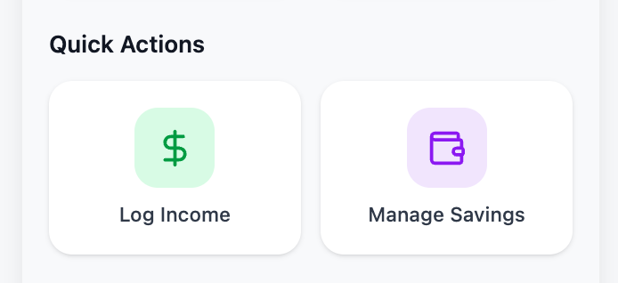
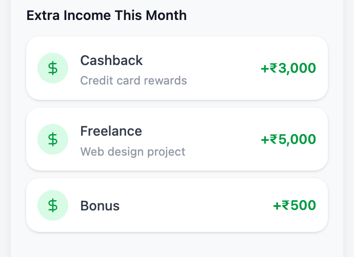
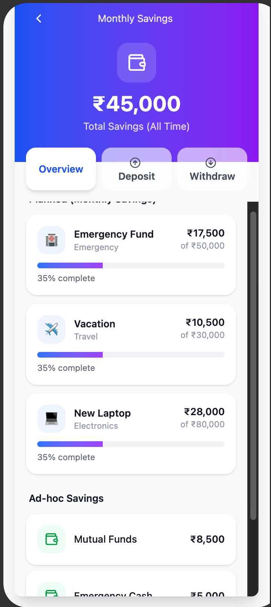
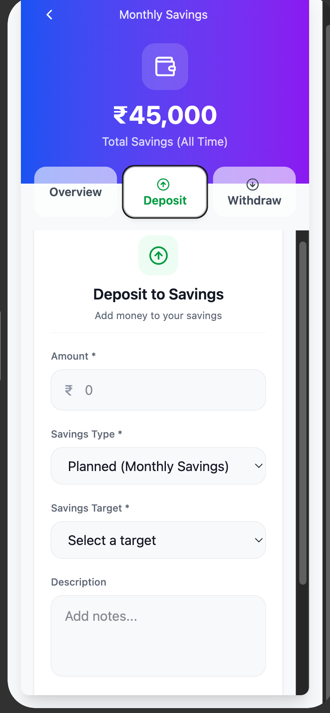
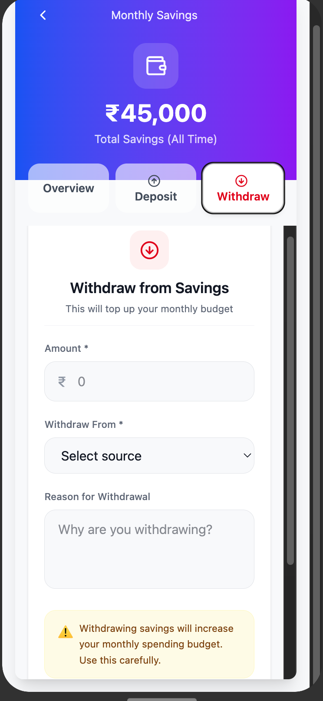

# Plan: Extra Income, Unified Savings & Overspend Deficit Tracking

> Source PRD: smgrv123/budgetmybs#7

## Architectural Decisions

Durable decisions that apply across all phases:

- **Schema**: New `additionalIncomeTable` (standalone; month derived from `date` field, not a FK). `savingsGoalId` nullable FK added to `expensesTable`. `isWithdrawal` flag added to savings expenses (amount stays positive, no negative amounts).
- **Income types**: `bonus`, `interest`, `cashback`, `gift`, `freelance`, `refund`, `savings_withdrawal`, `other`. The `savings_withdrawal` type is system-only — not shown in user-facing type dropdowns.
- **Budget formula**: `frivolousBudget + rolloverFromPrevious + SUM(income entries for month)`. Income is summed dynamically from `additionalIncomeTable` by month — no stored aggregate on the snapshot.
- **Rollover**: No floor. Negative rollover carries forward as a deficit. `Math.max(0, ...)` removed.
- **Savings balance**: `SUM(deposits) - SUM(withdrawals)` per `savingsGoalId` (goal-linked) or per `savingsType` (ad-hoc). Two separate balance derivations.
- **Savings `targetAmount`**: Monthly target (how much to save per month), NOT a lifetime accumulation goal.
- **Withdrawal atomicity**: One user confirmation → two DB writes: (1) savings withdrawal expense, (2) income entry with type `savings_withdrawal`. Fully atomic.
- **Chat pattern**: All new intents follow confirm-before-commit. No auto-commit for any new action.
- **Terminology**: "Savings Goals" → "Monthly Savings" across all UI and string constants.
- **Routes**: New `app/savings.tsx` route for dedicated savings screen. Income list/detail screens follow the same routing pattern as transactions (`app/all-transactions.tsx`, `app/transaction-detail.tsx`).
- **Dashboard sections**: All sections use a ranking + enable/disable config array (same pattern as settings screen).
- **Goal icons**: Derived deterministically from `SavingsType` — each type maps to an Ionicons icon name. No new schema field.
- **Bottom sheets**: Transaction and income creation use `BModal position="bottom"` from dashboard Quick Actions.

---

## Phase 1: Income — Data Layer ✅

**User stories**: Foundation for stories 1–10, 32–34

### What to build

Create the complete income data layer: schema table, type enum with display labels, query module with CRUD and monthly sum function, and a TanStack Query hook. No UI in this phase — this is purely the foundational layer that later phases depend on.

### Acceptance criteria

- [x] `additionalIncomeTable` exists in schema with `id`, `amount`, `type`, `customType`, `date`, `description`, `createdAt` columns
- [x] `IncomeType` enum and display labels follow the existing `as const` object pattern in `db/types.ts`
- [x] `savings_withdrawal` is present in the enum but excluded from user-facing label exports
- [x] Income query module exports: `createIncome`, `getIncomeByMonth`, `deleteIncome`, `getMonthlyIncomeSum`
- [x] `useIncome` hook exposes queries and mutations with consistent naming (`createIncome`, `createIncomeAsync`, `isCreatingIncome`, etc.)
- [x] `useIncome` is barrel-exported from `src/hooks/index.ts`
- [x] All new query functions are barrel-exported from `db/queries/index.ts`
- [x] Run `pnpm run typecheck` and `pnpm run lint` with no errors

---

## Phase 2: Income — Settings Screen ✅

**User stories**: 1–10

### What to build

A settings screen for logging extra income. This screen will be removed in Phase 13 when the income flow moves to the dashboard, but it was built first as a vertical slice to validate the data layer.

### Acceptance criteria

- [x] Settings screen exists at `app/settings/income.tsx`
- [x] User can add income with: amount (required), type dropdown (all types except `savings_withdrawal`), description (optional), date (defaults to today, editable)
- [x] Income entries for the current month are listed with amount, type label, date, and description
- [x] User can delete an income entry
- [x] `customType` text input appears when type is `other`
- [x] Screen is reachable from settings navigation
- [x] All user-facing strings are in a `src/constants/income.strings.ts` file
- [x] New screen and components follow B\* component rules and use theme constants
- [x] Run `pnpm run typecheck` and `pnpm run lint` with no errors

---

## Phase 3: Budget + Rollover Integration ✅

**User stories**: 9, 32–34

### What to build

Wire the income data layer into the monthly budget calculation. `getRemainingFrivolousBudget` now sums income entries for the month as a third component of available budget. The rollover calculation removes the `Math.max(0, ...)` floor so deficits carry forward. The budget summary visible on the dashboard and settings budget screen should reflect income as a named line item.

### Acceptance criteria

- [x] `getRemainingFrivolousBudget` returns `totalBudget = frivolousBudget + rolloverFromPrevious + additionalIncome`
- [x] `additionalIncome` field is included in the return value so UI can display it separately
- [x] Rollover formula is `totalPrevBudget - prevSpent - prevSaved` with no floor — result can be negative
- [x] A negative rollover is stored correctly on the next month's snapshot
- [x] `getMonthlySummary` includes `additionalIncome` in its return shape
- [x] Dashboard and budget summary UI surfaces show income contribution to budget when non-zero
- [x] `useMonthlyBudget` hook reflects updated return shape
- [x] Existing months with zero income are unaffected (sum returns 0, behaviour identical to before)
- [x] Run `pnpm run typecheck` and `pnpm run lint` with no errors

---

## Phase 4: Monthly Savings Rename ✅

**User stories**: 28–29

### What to build

A pure copy/terminology change with no logic modifications. Replace every instance of "Savings Goals" / "savings goal" (in user-facing strings only — not DB column names or internal identifiers) with "Monthly Savings" across all string constant files, UI components, and screen titles.

### Acceptance criteria

- [x] All screen titles, labels, button text, and empty-state copy that previously said "Savings Goal(s)" now say "Monthly Savings"
- [x] String constant files updated (no hardcoded strings remain in components)
- [x] No changes to DB schema, query functions, hook names, or enum values
- [x] Run `pnpm run typecheck` and `pnpm run lint` with no errors

---

## Phase 5: Savings — Schema + Balance Queries ✅

**User stories**: Foundation for stories 13–22, 30

### What to build

Schema and query foundation for unified savings. Add a nullable `savingsGoalId` FK to `expensesTable` and an `isWithdrawal` flag (integer, default 0) to distinguish deposits from withdrawals. Both fields only apply when `isSaving = 1`.

Add balance query functions: one that returns net balance per savings goal and one for ad-hoc savings grouped by `savingsType`. Update the savings hook to expose these balances.

### Acceptance criteria

- [x] `savingsGoalId` nullable FK exists on `expensesTable` referencing `savingsGoalsTable`
- [x] `isWithdrawal` integer column (default 0) exists on `expensesTable`
- [x] `getSavingsBalanceByGoal(goalId)` returns `{ deposited, withdrawn, net }` for a specific goal
- [x] `getSavingsBalancesByAllGoals()` returns an array of `{ goalId, deposited, withdrawn, net }` for all goals with activity
- [x] `getAdHocSavingsBalances()` returns an array of `{ savingsType, deposited, withdrawn, net }` for unlinked savings
- [x] Existing savings data (pre-migration) is unaffected — `savingsGoalId` and `isWithdrawal` default to null/0
- [x] Balance queries are barrel-exported from `db/queries/index.ts`
- [x] `useSavingsGoals` hook exposes balance queries
- [x] Run `pnpm run typecheck` and `pnpm run lint` with no errors

---

## Phase 6: Savings — Deposit UI ✅

**User stories**: 13–17, 30

### What to build

Savings deposit form and savings summary components. The deposit form collects amount, savings type, optional goal picker, and description. The savings summary shows each goal and ad-hoc type as its own line with net balance.

Note: This deposit form will be refactored into a tab in the dedicated savings screen in Phase 16.

### Acceptance criteria

- [x] Savings deposit form collects: amount, savings type, optional savings goal (filtered by type), description
- [x] "No goal / Ad-hoc" is always available in the goal picker regardless of type
- [x] Deposits linked to a goal correctly set `savingsGoalId` on the expense row
- [x] Ad-hoc deposits have `savingsGoalId = null`
- [x] Savings summary lists each goal with its net balance as a separate line
- [x] Ad-hoc savings of a given type appear as a separate line (e.g., "Mutual Funds (ad-hoc)")
- [x] Two goals with the same `savingsType` appear as two distinct lines identified by name
- [x] Total saved (sum of all lines) shown at the bottom of the summary
- [x] All user-facing strings in constants file
- [x] Run `pnpm run typecheck` and `pnpm run lint` with no errors

---

## Phase 7: Savings — Withdrawal UI ✅

**User stories**: 18–22

### What to build

Savings withdrawal form component. The form lets the user select a source (goal or ad-hoc type), shows available balance, and collects an amount. On confirmation, two DB writes happen atomically: a savings withdrawal expense and an income entry with type `savings_withdrawal`.

Note: This withdrawal form will be refactored into a tab in the dedicated savings screen in Phase 17.

### Acceptance criteria

- [x] Withdrawal form shows: source picker (goals + ad-hoc types with balances), available balance for selected source, amount field
- [x] Source picker only shows sources with a net balance > 0
- [x] Submitting a withdrawal creates both the savings withdrawal expense and the `savings_withdrawal` income entry atomically
- [x] Monthly budget increases by the withdrawal amount (via income entry)
- [x] Savings balance for the source decreases by the withdrawal amount
- [x] User cannot over-withdraw (amount > available balance is blocked with a validation error)
- [x] `savings_withdrawal` income entries do not appear in the manual income settings screen
- [x] Run `pnpm run typecheck` and `pnpm run lint` with no errors

---

## Phase 8: Dashboard Section Config Pattern

**User stories**: Foundation for stories 35–43

> **Reference**: See `plans/assets/quick-action.png` for the Quick Actions section layout

### What to build

Convert the dashboard screen from hardcoded section rendering to a data-driven ranking + enable/disable config array, matching the pattern already used in the settings screen. Each dashboard section (hero card, stat cards, recent transactions, etc.) becomes a config entry with a rank and enabled flag. No visual changes in this phase — purely structural refactor to make adding/reordering sections easy.

### Acceptance criteria

- [x] Dashboard sections are driven by a config array with `key`, `rank`, `enabled`, and `component` fields
- [x] Config pattern matches the existing settings screen implementation
- [x] Sections render in rank order, skipping disabled entries
- [x] All existing dashboard sections (header gradient, carousel, stat cards, recent transactions, FAB) continue to render identically
- [x] No visual regression — dashboard looks and behaves exactly the same
- [x] Run `pnpm run typecheck` and `pnpm run lint` with no errors

---

## Phase 9: Dashboard Quick Actions + Transaction Bottom Sheet

**User stories**: 35, 36, 43

> **Reference**: `plans/assets/quick-action.png`
>
> 
>
> Tiles are large cards with rounded corners, light-tinted icon background (green for income, lavender for savings), icon centered, label below in dark text. Two columns, full-width tiles.

### What to build

Add a Quick Actions section to the dashboard with three tiles: Log Transaction, Log Income, and Manage Savings. Move the existing transaction creation form from the FAB modal to a `BModal position="bottom"` triggered by the "Log Transaction" tile. Remove the FAB component from the dashboard.

"Log Income" and "Manage Savings" tiles are wired as stubs for now — Log Income shows a placeholder bottom sheet, Manage Savings logs a placeholder navigation. They get fully implemented in later phases.

### Acceptance criteria

- [x] Quick Actions section renders three tiles in a horizontal row: Log Transaction, Log Income, Manage Savings
- [x] Each tile has an icon and label
- [x] "Log Transaction" opens the existing transaction creation form in a `BModal position="bottom"`
- [x] Transaction creation works end-to-end from the new bottom sheet (same fields and behavior as before)
- [x] FAB is removed from the dashboard
- [x] Quick Actions section is registered in the dashboard config array from Phase 8
- [x] All user-facing strings in constants file
- [x] Run `pnpm run typecheck` and `pnpm run lint` with no errors

---

## Phase 10: Income Bottom Sheet Modal ✅

**User stories**: 1–7, 10, 37

### What to build

Wire the "Log Income" quick action tile to open a `BModal position="bottom"` with an income creation form. Form fields: amount (required, currency prefix), type dropdown (all user-facing income types — no `savings_withdrawal`), description (optional), date (defaults to today). On submit, creates an income entry via the existing `useIncome` hook and closes the modal.

### Acceptance criteria

- [x] "Log Income" quick action opens a bottom sheet modal with income form
- [x] Form fields: amount (required), type dropdown, description (optional), date (defaults to today)
- [x] `savings_withdrawal` type is not shown in the type dropdown
- [x] `customType` text input appears when type is `other`
- [x] Submitting creates an income entry and closes the modal
- [x] Income data on dashboard refreshes after creation
- [x] All user-facing strings in constants file
- [x] Run `pnpm run typecheck` and `pnpm run lint` with no errors

---

## Phase 11: Income Dashboard Section ✅

**User stories**: 8, 41

> **Reference**: `plans/assets/extra-income.png`
>
> 
>
> Each card: green circular icon ($ symbol) on left, income type label (bold, dark) with description text (muted, smaller) below it, amount in green with "+" prefix right-aligned.

### What to build

Add an "Extra Income This Month" section to the dashboard showing the 2 most recent income entries for the current month, plus a "View All" CTA. Each income card shows the type icon, type label, description, and amount (in green with + prefix). If no income entries exist for the month, the section is hidden. Register this section in the dashboard config array.

### Acceptance criteria

- [x] "Extra Income This Month" section appears on the dashboard between Quick Stats and Recent Transactions
- [x] Shows at most 2 most recent income entries for the current month
- [x] Each entry card shows: type icon, type label, description, and amount in green with "+" prefix
- [x] "View All" CTA is shown when entries exist
- [x] Section is hidden when no income entries exist for the month
- [x] Section is registered in the dashboard config array
- [x] All user-facing strings in constants file
- [x] Run `pnpm run typecheck` and `pnpm run lint` with no errors

---

## Phase 12: Income List + Detail Screens ✅

**User stories**: 42

### What to build

Create an income list screen and income detail screen, following the exact same patterns as the existing transaction list (`all-transactions.tsx`) and transaction detail (`transaction-detail.tsx`) screens.

The list screen shows all income entries for the current month in a scrollable list. Tapping any entry navigates to the detail screen where the user can edit or delete the entry. The dashboard "View All" CTA and individual income card taps navigate to these screens.

### Acceptance criteria

- [x] Income list screen exists as a new route, showing all income entries for the current month
- [x] Tapping an income entry navigates to the income detail screen
- [x] Income detail screen shows all fields and allows editing (amount, type, description, date)
- [x] Income detail screen allows deletion with confirmation
- [x] "View All" CTA on dashboard navigates to the income list screen
- [x] Tapping an income card on the dashboard navigates to the income detail screen
- [x] Navigation pattern matches the existing transaction flow
- [x] Route registered in root layout
- [x] All user-facing strings in constants file
- [x] Run `pnpm run typecheck` and `pnpm run lint` with no errors

---

## Phase 13: Settings Income Cleanup ✅

**User stories**: cleanup

### What to build

Remove the income settings screen and its entry point, since income logging now lives on the dashboard. Clean up all references.

### Acceptance criteria

- [x] `app/settings/income.tsx` is deleted
- [x] Income entry removed from settings financial section config
- [x] Income route removed from settings layout
- [x] No dead imports or references to the deleted screen remain
- [x] Settings screen continues to work correctly without the income entry
- [x] Run `pnpm run typecheck` and `pnpm run lint` with no errors

---

## Phase 14: Savings Screen — Route, Header, Tab Structure ✅

**User stories**: 38, 44, 45

> **Reference**: `plans/assets/savings-overview.png` (header + tabs), `plans/assets/savings-deposit.png` (Deposit tab active state), `plans/assets/savings-withdraw.png` (Withdraw tab active state)
>
> 
>
> **Header**: Blue-to-purple gradient, wallet icon in rounded square, large total amount, "Total Savings (All Time)" subtitle in white.
> **Tabs**: Three tab pills in a row. Active tab = white card background with colored icon (green up-arrow for Deposit, red down-arrow for Withdraw) and colored text. Inactive tabs = transparent with muted icon and dark text.

### What to build

Create a new dedicated savings screen at `app/savings.tsx` (outside the settings group). The screen has a gradient header (reusing the existing `LinearGradient` pattern) showing a wallet icon and total savings amount (all time). Below the header, three horizontal tab buttons: Overview, Deposit, Withdraw. Tapping a tab switches the content area below.

Wire the "Manage Savings" quick action tile on the dashboard to navigate to this screen. Tabs render placeholder content for now — each tab's real content is built in subsequent phases.

### Acceptance criteria

- [x] `app/savings.tsx` route exists and is registered in the root layout
- [x] Screen has a gradient header with wallet icon, total savings amount, and "Total Savings (All Time)" label
- [x] Three tab buttons (Overview, Deposit, Withdraw) are rendered below the header
- [x] Active tab is visually distinguished (different background/text color)
- [x] Tapping a tab switches the content area
- [x] "Manage Savings" quick action on dashboard navigates to this screen
- [x] Back navigation returns to dashboard
- [x] All user-facing strings in constants file
- [x] Run `pnpm run typecheck` and `pnpm run lint` with no errors

---

## Phase 15: Savings Screen — Overview Tab ✅

**User stories**: 46, 47, 48

> **Reference**: `plans/assets/savings-overview.png`
>
> 
>
> **Goal cards**: Emoji/type icon in a rounded square bg (left), goal name bold + type label muted below it, amount saved bold (right) + "of ₹X" muted below. Progress bar full-width below (blue-purple gradient fill). "X% complete" caption below bar. Cards have white background with subtle shadow/border.
> **Ad-hoc section**: "Ad-hoc Savings" bold section header, then items with green wallet icon, name, amount right-aligned. No progress bar on ad-hoc items.

### What to build

Build the Overview tab content for the savings screen. Shows goal cards and an ad-hoc savings accordion.

Each goal card displays: an icon (derived from `SavingsType`), goal name, type label, a progress bar showing this month's deposits against the monthly `targetAmount`, percentage complete, all-time cumulative total, and a checkmark when the monthly target is met.

The ad-hoc section is an accordion: collapsed shows the total ad-hoc savings amount. Expanding reveals individual ad-hoc savings items grouped by type, paginated 5 at a time with a "Show more" CTA.

### Acceptance criteria

- [x] Overview tab shows a card for each savings goal
- [x] Each goal card shows: icon (mapped from SavingsType), name, type label, monthly progress bar, percentage, all-time total
- [x] Progress bar reflects this month's deposits vs the goal's `targetAmount` (monthly target)
- [x] Checkmark or visual indicator shown when monthly target is met (deposits ≥ targetAmount)
- [x] New query: get monthly deposit sum per goal for the current month
- [x] Ad-hoc savings section rendered as an accordion (collapsed: total amount, expanded: individual items by type)
- [x] Ad-hoc items are paginated 5 at a time with a "Show more" CTA
- [x] SavingsType → Ionicons icon mapping defined in a constants file
- [x] All user-facing strings in constants file
- [x] Run `pnpm run typecheck` and `pnpm run lint` with no errors

---

## Phase 16: Savings Screen — Deposit Tab

**User stories**: 13, 14, 49, 50

> **Reference**: `plans/assets/savings-deposit.png`
>
> 
>
> Form title "Deposit to Savings" bold centered, subtitle "Add money to your savings" muted. Amount field with ₹ prefix. "Savings Type _" dropdown. "Savings Target _" dropdown (appears when type is Planned). Description textarea. "Confirm Deposit" button (green, full-width) at bottom.

### What to build

Build the Deposit tab content for the savings screen. The form has a single "Deposit To" dropdown listing all savings goals by name, plus an "Ad-hoc" option at the bottom. When "Ad-hoc" is selected, a secondary "Category" dropdown appears showing all `SavingsType` options. Amount field, description field, and a "Confirm Deposit" button.

Refactor the existing `SavingsDepositForm` component to work as tab content rather than a modal form, adapting its logic to the new "Deposit To" dropdown pattern (goals first, ad-hoc as fallback) instead of the old savings type → goal picker pattern.

### Acceptance criteria

- [x] Deposit tab shows a form with: "Deposit To" dropdown, amount, description, confirm button
- [x] "Deposit To" dropdown lists all savings goals by name + "Ad-hoc" option
- [x] Selecting "Ad-hoc" reveals a secondary category dropdown with SavingsType options
- [x] Selecting a goal directly sets the `savingsGoalId` and `savingsType` from the goal
- [x] Amount and description fields work correctly
- [x] Confirm creates a savings expense with correct `savingsGoalId` (or null for ad-hoc)
- [x] Form resets after successful deposit
- [x] Total savings in header updates after deposit
- [x] All user-facing strings in constants file
- [x] Run `pnpm run typecheck` and `pnpm run lint` with no errors

---

## Phase 17: Savings Screen — Withdraw Tab + Settings Savings Cleanup ✅

**User stories**: 18, 19, 20, 21, 22, 51, 52

> **Reference**: `plans/assets/savings-withdraw.png`
>
> 
>
> Form title "Withdraw from Savings" bold centered, subtitle "This will top up your monthly budget" muted. Amount field with ₹ prefix. "Withdraw From \*" dropdown ("Select source"). "Reason for Withdrawal" textarea placeholder "Why are you withdrawing?". Yellow/amber warning banner with ⚠️ icon: "Withdrawing savings will increase your monthly spending budget. Use this carefully." "Confirm Withdrawal" button (red, full-width) at bottom.

### What to build

Build the Withdraw tab content for the savings screen. Inverse of the deposit flow: "Withdraw From" dropdown shows only sources (goals by name, ad-hoc types by label) that have a positive net balance. Shows available balance inline after selection. Amount field with validation (≤ available balance). "Reason for Withdrawal" text field. Warning banner explaining budget impact. "Confirm Withdrawal" button (red/danger variant).

On confirmation, creates both the savings withdrawal expense and the `savings_withdrawal` income entry atomically.

Also clean up the settings savings screen: remove the deposit and withdraw buttons/modals, keeping only the BListStep goal CRUD functionality.

### Acceptance criteria

- [x] Withdraw tab shows: "Withdraw From" dropdown, available balance, amount field, reason field, warning banner, confirm button
- [x] "Withdraw From" dropdown only shows sources with net balance > 0
- [x] Available balance updates when source selection changes
- [x] Amount validation blocks over-withdrawal (amount > available balance)
- [x] Warning banner text explains that withdrawing increases monthly spending budget
- [x] Confirm button uses danger/red variant
- [x] Submission creates both savings withdrawal expense and `savings_withdrawal` income entry
- [x] Total savings in header and Overview tab update after withdrawal
- [x] Settings savings screen (`app/settings/savings.tsx`) no longer shows deposit/withdraw buttons or modals
- [x] Settings savings screen retains full BListStep goal CRUD functionality
- [x] All user-facing strings in constants file
- [x] Run `pnpm run typecheck` and `pnpm run lint` with no errors

---

## Phase 18: Dashboard Savings Checklist Card

**User stories**: 39, 40

### What to build

Merge the existing "Completed" and "Goals" (or "Incomplete") quick stat cards on the dashboard into a single "Savings" checklist card. The card shows each monthly savings goal as a line item with the goal name and target amount. Goals that have been completed for the current month (this month's deposits ≥ `targetAmount`) appear with strikethrough text and a checkmark.

### Acceptance criteria

- [x] "Completed" and "Goals"/"Incomplete" stat cards are merged into a single "Savings" card
- [x] Savings card shows total monthly savings target and goal count (same compact design as Fixed/EMIs)
- [x] Tapping the card opens the existing quick stat bottom sheet
- [x] Run `pnpm run typecheck` and `pnpm run lint` with no errors

---

## Phase 19: Chat — Income Intent ✅

**User stories**: 11, 12

### What to build

Add `add_income` to `ChatIntentEnum` and `ChatResponse` discriminated union. Create `ChatIncomeData` type. Update the system prompt with an income capability block and example JSON. Build an inline income confirmation form with amount, type dropdown, description, and date fields. Wire the new intent into the chat screen's send handler and `PendingAction` type. Add `useIncome` to the chat screen's data dependencies and pass current month's income to `ChatContext`.

### Acceptance criteria

- [x] `ChatIntentEnum.ADD_INCOME` exists and is handled in the chat screen switch
- [x] System prompt includes income capability block with trigger phrases and example JSON
- [x] `ChatIncomeData` type defined in chat types
- [x] Inline income confirmation form shows: amount, type dropdown (no `savings_withdrawal`), description, date
- [x] Confirmed income entries are created via `useIncome` mutation
- [x] Action status is marked completed on confirm, cancelled on dismiss
- [x] New string constants added to chat constants
- [x] Run `pnpm run typecheck` and `pnpm run lint` with no errors

---

## Phase 20: Chat — Savings Deposit Intent ✅

**User stories**: 23, 24

### What to build

Add `log_savings` to `ChatIntentEnum` and `ChatResponse`. Create `ChatSavingsData` type. Update system prompt with savings deposit capability. The AI is given the list of active monthly savings (goals) in context and attempts to match to a goal. Build an inline savings confirmation form with amount, goal picker (pre-populated with AI's match, user can change), and description. Wire into chat screen.

### Acceptance criteria

- [x] `ChatIntentEnum.LOG_SAVINGS` exists and is handled
- [x] System prompt includes savings deposit capability with example JSON showing goal matching
- [x] Active monthly savings (name, type, id) are included in the `ChatContext` passed to the service
- [x] AI response includes `savingsGoalId` when it can match, null otherwise
- [x] Inline savings form pre-selects the AI-matched goal; user can override via dropdown
- [x] Goal dropdown lists all goals + "Ad-hoc" option (with secondary category picker for ad-hoc)
- [x] Confirmed savings are created with correct `savingsGoalId` (or null for ad-hoc)
- [x] Run `pnpm run typecheck` and `pnpm run lint` with no errors

---

## Phase 21: Chat — Savings Withdrawal Intent ✅

**User stories**: 25–27

### What to build

Add `withdraw_savings` to `ChatIntentEnum` and `ChatResponse`. Create `ChatWithdrawalData` type. Savings balances (per goal and per ad-hoc type) are added to `ChatContext` so the AI can validate the withdrawal against available funds and warn inline if over-limit. Build an inline withdrawal confirmation form showing source and available balance. On confirm, the same atomic two-write operation is triggered. Wire into chat screen.

### Acceptance criteria

- [x] `ChatIntentEnum.WITHDRAW_SAVINGS` exists and is handled
- [x] Savings balances (goal balances + ad-hoc type balances) are included in `ChatContext`
- [x] System prompt includes withdrawal capability with balance-aware guidance
- [x] AI warns in its message if the requested amount exceeds available balance
- [x] Inline withdrawal form shows source, available balance, and amount field
- [x] Client-side validation also blocks over-withdrawal before submission
- [x] Confirmed withdrawal triggers atomic savings expense + `savings_withdrawal` income creation
- [x] Run `pnpm run typecheck` and `pnpm run lint` with no errors

---

## Phase 22: Chat — Monthly Savings Intent Rename ✅

**User stories**: 31

### What to build

Rename the existing savings goal chat intents in all surfaces: `ChatIntentEnum` values (`ADD_SAVINGS_GOAL` → `ADD_MONTHLY_SAVINGS`, etc.), `ChatResponse` discriminated union arms, system prompt capability blocks, `CHAT_FORM_TITLES`, switch cases in the chat screen handler, and all related string constants. Update `UpdatableIntent` union in inline update form. No functional change — purely a naming alignment with the "Monthly Savings" terminology.

### Acceptance criteria

- [x] `ChatIntentEnum.ADD_MONTHLY_SAVINGS`, `UPDATE_MONTHLY_SAVINGS`, `DELETE_MONTHLY_SAVINGS` replace old savings goal values
- [x] `ChatResponse` union updated to use new intent names
- [x] System prompt capabilities section uses "Monthly Savings" terminology
- [x] All switch cases, form titles, field keys, and string constants updated
- [x] `UpdatableIntent` union in inline update form reflects new intent names
- [x] Existing monthly savings CRUD via chat continues to work end-to-end
- [x] Run `pnpm run typecheck` and `pnpm run lint` with no errors
